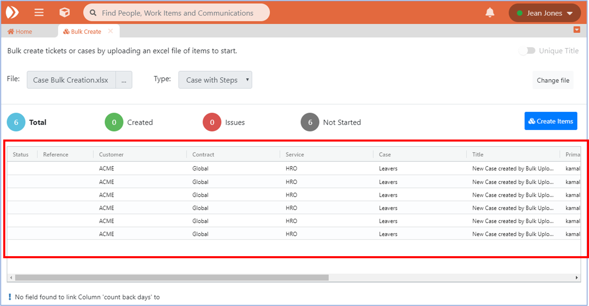
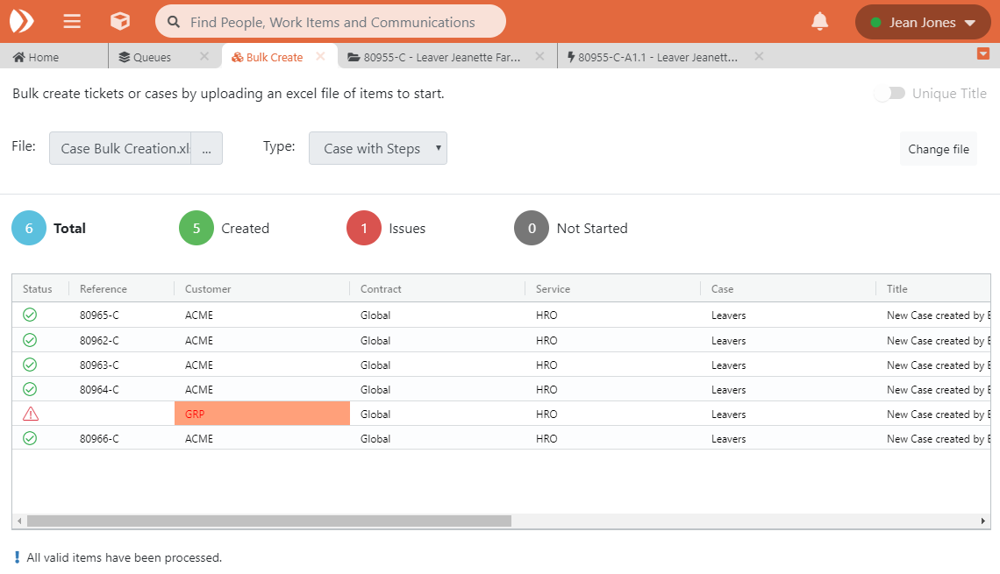
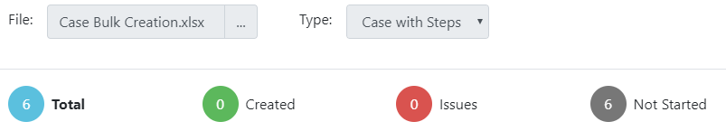
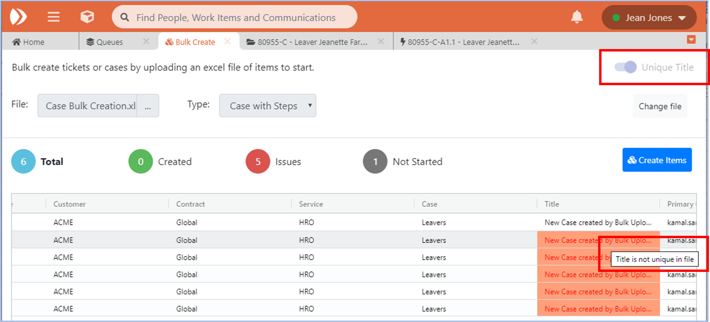

# 11. Bulk Create of Work Items

You can create Cases and Tickets in bulk via the uploading of data from Excel spreadsheets.

In order to create Bulk Work Items, you must fill in the following mandatory fields in an Excel file \(xlsx\).

The mandatory fields which must be filled in order to create a Case are:

1. **Customer**
2. **Contract**
3. **Service**
4. **Case** – the name of the Case Process instance you wish to create into.
5. **Title** – This will be the title for the individual Case work item.
6. **Primary Contact** \(name or email\)
7. **Requester** \(name or email\)
8. **Subject** \(name or email\)

The mandatory fields which must be filled in order to create a Ticket are:

1. **Customer**
2. **Contract**
3. **Service**
4. **Ticket**
5. **Title**
6. **Ticket Description**
7. **Ticket Category Level 1**
8. **Ticket Category Level 2**
9. **Ticket Category Level 3**
10. **Primary Contact**
11. **Requester**
12. **Subject**


Note: for Ticket creation you must also provide valid Ticket Category information as part of the upload file.


Below are Bulk Create Case Templates and Bulk Create Ticket Templates:






Note: Data entered, e.g. Customer names, must match the values in the system, otherwise validation errors will be displayed. Also only one workbook can be used at a time.


You can also pass bespoke field data into the Cases as they are being created. To do this, add a column name which precisely matches the data field name in Enate.

If any of these bespoke fields are marked as mandatory in your Case process configuration, you MUST supply a value in this field’s column for every row in the upload file \(otherwise that row will fail validation and a Case will not be created for it\).

Once you are happy with the data in your upload file, click on the ‘Bulk Create’ link in the ‘Create New Work Item’ dropdown.

This will bring up the Bulk Create screen in a new tab. From this screen, select the ‘…’ in the File control to upload the Excel file, and the select which type of Case process or Ticket you intend to bulk create these items into. Select the Type of Case or Ticket and click on the ‘Upload’ button.

This will upload your information on-screen.

When you are ready to go, click ‘Create Items’. The system will start creating your Cases / Tickets, and update the display to show the Reference numbers.

The valid Cases / Tickets will be created and on-screen confirmation will be displayed, along with Reference number for each item.

## A. Validation

Any validation errors will be highlighted in red and a ‘warning’ status icon will be displayed. These need to be resolved before proceeding further.

If the input values are wrong throughout an entire column, validation errors will be displayed at the bottom of the grid. Example: If a field column is referenced in the upload file which does not exist in the system, the validation error message will show at the bottom of the grid, e.g. “No field to link Column ‘count back days’”.

If the input values are wrong for an individual row, a ‘warning’ status icon will be displayed at the start of the row and the individual validation errors will be highlighted in red.

In order to fix these validation errors, you can adjust the data in the underlying file , and click the ‘Change file’ link to upload the adjusted file.

### **Supported Fields**

Bulk create supports below list of custom field type-

1. **Check Box**
2. **Date Only**
3. **Date and Time**
4. **Decimal Number**
5. **Email Address**
6. **List**
7. **Long Text**
8. **Multiple level list**
9. **Short Text**
10. **Whole Number**

Other than custom fields bulk create supports below system properties -

1. Override Due Date
2. Override Due Date set

### **Unsupported Fields**

Bulk upload does not support below custom field type-

1. Tables
2. Entity Relationship

There are a few other system properties which cannot be added in bulk upload are below-

1. Keep with me
2. Keep Action with me
3. Defects
4. Files

Across the top of the Grid, the system will also display information about the number of work items being created, split across current status.

* **Total** – No of items contained in the upload file
* **Created** – No of packets created successfully \(this will be zero before you start to create\).
* **Issues** – No of packets with validation issue – this can increase with final validation check made during Case / Ticket creation.
* **Not Started** – No of items remaining to be processed from the file.

Additionally for each line you will see:

**Status** - Current state of Case item i.e. created, error  
**Reference** - Reference of Case once it has been Created successfully.

If you have any validation issues at this point, you can still proceed with creation of the valid Case items in your upload file. The system will skip over the invalid rows and confirm creation of the valid ones.

Alternatively you can fix the validation issues in your upload file before proceeding. Click on “change” at the top of the page to upload the corrected file before proceeding.

### **Unique Title Setting**

A further setting which can be used when uploading bulk files is the ‘Unique Title’ option at the top right of the screen.

Leaving this option off allows work items with duplicate titles to be created.

Switching this option on will ensure that any work item which is due to have the same title as another item in the upload file will fail validation. If the title uniqueness check is failed, the system will show a validation error and skip over this row. Any items which fail validation will not be created \(i.e. will be skipped over\), but all other valid rows will be created. In other words, you do not have to have a 100% valid file to carry out a bulk upload.

Click [here ](15.-appendix/15.1-potential-validation-errors-for-bulk-creation-of-work-items.md)to see the full list of potential validation errors for Bulk Create.

## B. Multilingual Support in Bulk Create

Bulk Create is also supported in all of the languages that Enate offers. Below are Bulk Create Case Templates and Bulk Create Ticket Templates in these other languages.






Note: a bulk create Excel file should be in the same language as the logged-on User’s preferred languages. For example, if a Spanish user wants to upload a file then the Excel file should be in Spanish and the values should match with the values that are configured in Enate Builder under the localisations tab. For example, if the fields like **Primary contact, Requester, CC, Subject** have translation values in the localisation tab like **Contacto Primario, Solicitante, CC, Asunto**, then these same values need to be configured in the template.


