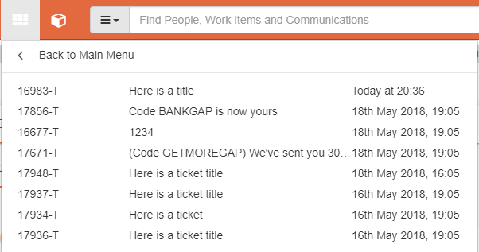

# 4.2 Recently Accessed Work Items

If you wish to quickly re-access a work item \(e.g. you wish to re-open a work item tab you’ve just closed down\), open the ‘Recently Accessed’ link from the navigation dropdown.

This will display a list of the last 20 items which you have accessed \(along with datetime the tab was closed\), ordered by most recent first. Click an item to re-open the tab.

## 

