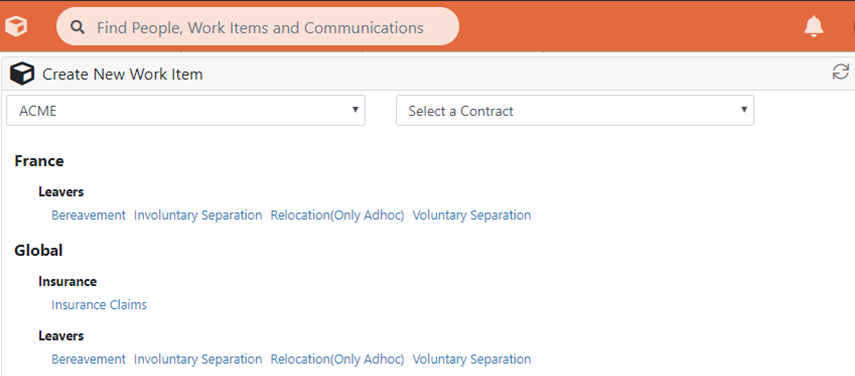

# 6.1 Die Dropdown-Liste 'Neuen Arbeitsauftrag erstellen'

* Sie können nicht nur neue Arbeitsaufträge vom Bildschirm Benutzerdetails/Anrufbearbeitung aus erstellen, sondern auch durch Klicken auf den Link ‘‘Erstellen’’ in der Kopfzeile \(Würfelbild\) - dies führt zu einem Dropdown-Abschnitt, in dem Sie einen neuen Arbeitsauftrag starten können
* Nutzer mit mehreren Kunden können oben im Abschnitt der Dropdown-Listen nach Kunden und Vertrag filtern.
* Eingabe-Links erscheinen hier automatisch für Tickets und Fälle, wenn Sie einen Ticket- oder Fallvorgang im Builder erstellt und auf Live gesetzt haben
* Wenn Sie auf einen Link klicken, wird der neue Arbeitsauftrag in einem separaten Fenster erstellt


_Anmerkung: Wenn sie im Testmodus sind, werden Prozesse, die sich im Zustand 'validierter Entwurf' befinden, hier angezeigt_


