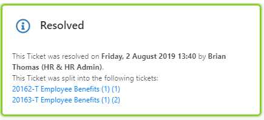
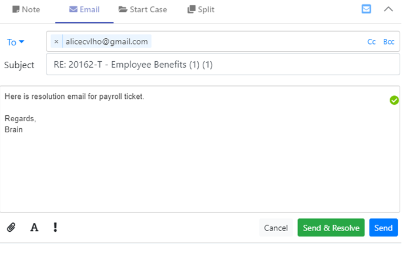

# 7.10 Ticket Screen specifics

The Ticket screen display emphasises the comms timeline, to allow you to focus primarily on the communications trail between agents and the primary contact for the Ticket.

## A. Further Activities available for Ticket

In addition to adding notes and emails from the activity section, you can also do the following:

* Turn the Ticket into a Case \(Start Case\).
* Merge the Ticket into another Ticket/Case/Action.
* Split the Ticket into multiple separate Tickets.

### Merging Ticket into another Ticket/Case/Action

The Merge option is only relevant if the Ticket has been started via email. There are two ways of merging available:

* Close THIS Ticket \(and merge it into an existing Ticket / Case / Action in the system.\)
* Keep this Ticket open \(and merge other existing Tickets into this one\).

**Option 1 – Close this Ticket, Merge it into another work Item**

Access the merge tab. By default, it will be set to closing THIS Ticket, and looking for other Tickets to merge. You can enter search criteria to locate the desired other Ticket / Case or Action \(must be a legitimate, i.e. running, work item\). Select the desired work item to merge this Ticket into.

To confirm, select the Merge button form the Info card.

The work item tab will close. If you view this ‘closed’ Ticket again, status in info card will display as ‘Resolved’ with a link to the work item it was merged into:

Communications from the now closed Ticket will display in the timeline of the remaining Ticket, with a marker to show they are new \(markers will clear on any manual update to the Ticket\).

**Option 2 – Keep this Ticket open, Merge other Tickets into it**

To keep this Ticket open and merge other existing Tickets into it, select to close ‘Other work Items’.

To confirm, select the Merge button form the Info card. 

The other Tickets will be set to ‘Resolved – Existing Ticket updated’. Communications from the now closed Tickets will display in the tideline of the remaining Ticket, with a marker to show they are new \(marker will clear on any manual update to the Ticket\).

### Splitting a Ticket

If a Ticket contains multiple separate queries / questions which are better managed separately you can split the Ticket. Click on the Split tab in the Activities tabs to start the split:

* Screen will default split into two Tickets. You can manually add more splits.
* Title, Description and Context \(Customer &gt;&gt; Ticket Category etc.\) are copied from the current Ticket, but all can be modified before you finish the Ticket split.
* You can choose to keep each separate Ticket with you.
* Confirm the Ticket split by clicking the button in the Info card:

After splitting, the original Ticket will be set to ‘Resolved – split Ticket’ and does not form any further part of service delivery \(it is essentially closed\).

  
Once the split Tickets are resolved, this original Ticket will be set to fully complete. For SLA purposes the start date of the original Ticket is copied to each of the Resulting Tickets.

You can cancel the splitting of a Ticket at any time by navigating away from the Split tab \(the main Action button on the Ticket changes away from ‘Split’, so you can be sure you’re not splitting it\).

### Turn Ticket into a Case \(Start a Case\)

If during processing of a Ticket query it becomes apparent that the request is better handled via a specific Case, you can support this by choosing to start a Case from the Ticket.

Click on the ‘Start Case’ tab within the Ticket.

* Select the Contract&gt;Service and Case type you wish to launch
* You can choose to keep each separate Ticket with you.
* Confirm the Ticket promotion up to a Case by clicking the button in the Info card: 
* You will see the confirmation messages at the bottom of this section informing you that the Ticket will be closed and replaced by a Case \(with the same reference number, but a ‘-C’ ending\), and that an email will be sent to the primary contact informing them of this.
* If you do NOT want such emails to be sent to the primary contact for this Ticket, set the ‘Disable Automated Emails’ setting in the Settings card to True. When set, the information message at the foot of ‘Start Case’ about email will not display.

After promoting the Ticket to a Case, the original Ticket will be set to ‘Ticket replaced by Case’ and does not form any further part of service delivery \(it is essentially closed\).

## B. Initial Ticket Submission

To submit a Ticket, you must:

* Add a Title
* Enter a Ticket description in the section provided \(After submitting, this section will disappear and instead will show as the initial submission note\).
* Set a Ticket Category in the Settings Tab
* Set a Primary Contact and a Requester in the Contacts section.

Then hit the ‘Submit’ button.


Note: For manually created Tickets which have yet to have a title and description entered for them, if you send out an email prior to initial submitting \(and saving\) of the Ticket, the system will auto-populate the Ticket title and description from the email subject and description respectively.


Upon sending an email, the email’s subject and body are copied into the Ticket’s title and description.

### Validation

If you do not enter required information, the system will bring up a validation message:

Once you have successfully submitted the Ticket, the tab will close, and a confirmation popup will display.

You can click the Ticket reference link on this message to immediately re-open the tab \(note that the Ticket may still be processing if you re-open the tab immediately\). Alternatively, you can re-open using the ‘Recently Accessed’ link at the foot of the navigation dropdown.

## C. Processing a Ticket - Options

There are a number of options for how to process a running Ticket, i.e. different states to put it into as part of dealing with it.

These are:

* Resolve
* In Progress
* Pause
* Reject
* Re-open a resolved Ticket.

By default, a Ticket will normally be in a state of ‘In Progress’.

### Resolving a Ticket

When you select to resolve a Ticket, you must either:

* Send a resolution email

or

* Add an internal resolution note

In the same session. If you mark the Ticket as resolved and have not done either of these, the system will bring up a reminder message:

If you then choose to send a resolution email, the system will show this with a green tick in the email or note:

You will then be able to mark the Ticket as resolved.

**If you have already added a resolution**

If you have just added a note or sent an email before marking as ‘resolved’, the system will automatically mark this accordingly, and will not ask you to add a further resolution confirmation.

**Subsequent Resolution Note / Email display in timeline.**

For resolved Tickets, you will be able to see the note / email which was tagged as the resolution highlighted in green with tick marker:

**Quick Resolution**

For quick resolution, you can also send your resolving email and mark the Ticket as resolved in a single click. Just click the ‘Send and Resolve’ button at the foot of the email you are sending.


Note, this option is not available if you are sending an email from the pop-out screen. You need to come back to the main Ticket browser screen to confirm resolution of the Ticket.


### Set back to ‘In Progress’

Re-select this option if you wish to take the Action off Pause.

### Re-opening a Ticket

Once a Ticket has been set as resolved, the system will wait with the item in a state of ‘Waiting for Feedback’. During this period, you have the ability manually re-open the Ticket \(alternatively if the primary contact sends in another email on the Ticket during this period, the Ticket will automatically re-open anyway\).

### Pause

Two types of pause are available for Tickets:

**Wait for more information**

Use this option if you are waiting for additional information from the client. You do not _have_ to send out an email to contact but the system will provide a reminder message recommending this. Fill in the number of days to wait as desired and confirm by hitting ‘Pause’.

Subsequently, when a response email arrives from the contact, the system will:

* Reassign the work back to the agent \(so it shows back in their Inbox, not just their ‘Owned Work’ list\).
* Highlight the work item in the inbox grid. 
* Alternatively, if you have set the ‘Close if no response received’ to On, then upon reaching the number of days to wait if there has been no response received from the client, the Ticket will automatically close.

**Follow Up**

Use this option if you are simply wanting to follow up on the work item at a certain date and time. Fill in the datetime as desired and confirm by hitting ‘Pause’.

Subsequently, when the follow up date arrives, the system will:

* Reassign the work back to the agent \(so it shows back in their Inbox, not just their ‘Owned

### Stopping the clock on Work Items in a state of Pause

The Remaining Hours of SLA when Work Item is Pause will be displayed.

This feature is an enhancement of Stopping the clock on the work items which are in a state of pause.

If a work item is in a state of Pause, and the Due Date rule configured in Builder is set to ‘Add wait time to due date’, then the system does not display the due date in the header ribbon. Instead the system shows the remaining time left until the item is Due. If the work item is yet to pass the due date the the message will show as ‘**Due: Paused** x **h** y **m before due**’. If the work has passed the due date then the message will show as ‘**Due: Paused** x **h** y **m after overdue**’.

Example: work item which is paused where its due date is **on target** or **due today**.

### Reject

If you wish to reject the Ticket entirely, select the Reject option from the dropdown. Tick if the item is being rejected due to being spam email and hit ‘Reject’ button to confirm.

## 

