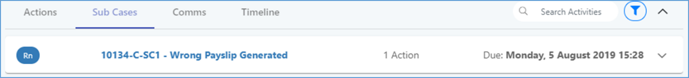
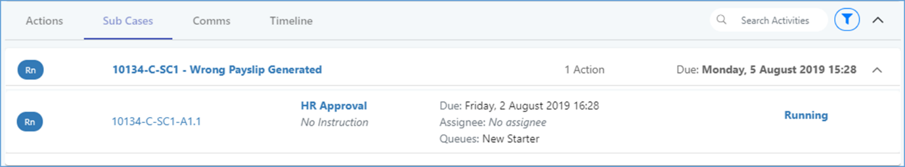
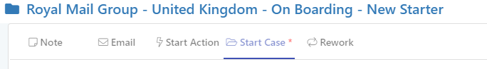

# 7.11 Case Screen specifics

## A. The Actions Tab

The Case screen display emphasises the Actions running for it. To support this, an additional tab exists in the timeline section, to allow you to quickly see the status of its Actions and to access them. This is the default displayed tab in this section for Cases.

This will show the following information for any Actions under this Case:

* Current State icon
* Parent Case and Action reference number
* Action title and instructions
* Due Date, Assignee, Queue
* State in text form

## B. The Sub-Cases Tab

If a Case contains Sub-Cases, and additional tab will show next to the Actions tab. This will show the following information for any Sub-Cases under this Case:

* Current State icon
* Sub Case reference number and Case title
* Action Count – The count of Actions associated with this Sub-Case
* Assignee – The Case assignee _\(If defined\)_
* Queue – The Cases Queue _\(If defined\)_
* Due Date – The Case due date
* Expand Icon – Reveals all Actions of a chosen sub Case

### Expanding the Sub-Case to view Actions

Expanding a Sub-Case will display the Actions underneath it, with the same information as displayed in the standard Actions section.

### Sub-Case Reference Number Logic

Reference numbers of sub Cases can be broken down as follows:

Sub Case Number

Action Number

Parent Case Reference

## C. Initial Case Submission

To submit a Case, you must:

* Enter a Case short description in the section provided.
* Set a Primary Contact and a Requester in the Contacts section – IF the Case type requires contacts to be set.

Then hit the ‘Submit’ button.

## D. Activities available for Case

In addition to adding notes and emails from the activity section, you can also do the following:

* Start an Action
* Start a Case / Sub-Case
* Choose to Rework the Case

### Starting an Action

Most often the Actions in a Case are started automatically \(either by process flow or based on schedules\). However, if an Action has been configured to be manually startable, you can do this from the Case.

* Select the ‘Start Action’ tab in the Activities section. In the resulting panel, choose the Action type to launch \(must have been configured as manually startable in Builder\), set a due date and specify how many of the Action you wish to launch.
* Specify the Action instructions if you wish these to be different from the default instructions displayed.
* Hit ‘Start Action’ to confirm.

You can refresh the screen display to see the newly created Action:


Note:

* You do not need to have the Case assigned to you in order to launch a new Action.
* This option is also available from any of the Actions within the Case.


The tab will not close upon launching the new Action, as this is an additive activity which does not modify the current Case.

### Start a Case / Sub-Case

If you wish to start a new Case or Sub-Case, select the ‘Start Case’ tab.

* In the resulting pane, choose a Contract, Service and Case type to launch \(these will default in values if there is only one option to choose\)
* Enter a short description for the Case
* If you do not wish the new work item to be a Sub-Case, set the ‘Independent’ slider to On
* Hit ‘Start’ Case to complete

The tab will not close, as this is an additive activity which does not modify the current Case.

### Rework

If issues have occurred during the running of a Case, you may wish to rework the Case.

* To do this, select the ‘Rework’ tab. In the resulting panel, choose the previous Case Step you wish to re-start from.
* Since this impacts the current Case, you will need to click the ‘Rework’ button from the Info card to confirm this change.


Note: This option is also available from the info card Status button dropdown.


### Auto-Assignment of Actions started while Case is in Rework

When an Action is started in a Case which is currently in rework, the Action will auto-assign to the same user who previously performed the same Action \(either the user who completed the Action or, if it was not completed previously then the last user it was assigned to\).

_Note: If “Keep Actions with Me” is selected on the Case, the ‘keep with’ logic will take precedence._

### Select Step / Action to restart Case from

You can optionally choose a specific Action within a Step to rework from instead of restarting from the beginning of the Step.


Note: In order to re-evaluate the Case Conditions, rework must be started from the start of a step. Further specifics on this:

* You cannot rework from an Action which was started as an ad-hoc Action.
* Users are still limited to reworking from steps prior to the current one, and so are also limited to choosing Actions from within prior steps.
* If rework is performed multiple times then there may already be downstream steps that were previously completed - however they are not eligible for selection as restart point.


### Selecting Sub-Cases and Ad-Hoc Actions to be closed as part of Rework

When rework is started on a Case, you are shown a list of running Actions and Sub Cases. You can select which manually started Actions \(Ad-hoc Actions\) and Sub-Cases should be terminated when Rework begins.

Running Actions which were not started as ad-hoc activities, i.e. those started as part of the process flow, will always be automatically terminated when the Case is set to rework.

## E. Processing a Case - Options

### Initial Case Submission

Cases can be started in the following ways:

* Via an incoming email \(if the system is configured to do so for that email mailbox\)
* By a ‘Start Case’ Action within another Case flow.
* Manually, from the ‘Create New Work Item’ link in the Work Manager toolbar
* Automatically started
* Via third party integrations

When starting manually, you should fill in the ‘Case Short Description’.

There are a number of options for how to process a running Case, i.e. different states to put it into as part of dealing with it.

These are:

* Continue
* Pause
* Needs Attention
* Abort
* Rework

By default, a Case will normally be in a state of ‘Continue’.

### Set as Continue

Re-select this option if you wish to take the Action off Pause.

### Pause

Two types of pause are available:

**Wait for more information**

Use this option if you are waiting for additional information from the client. You do not _have_ to send out an email to contact but the system will provide a reminder message recommending this. Select the reason from the dropdown by hitting ‘Pause’ button.

Subsequently, when a response email arrives from the contact, the system will:

* Reassign the work back to the agent \(so it shows back in their Inbox, not just their ‘Owned Work’ list\).
* Highlight the work item in the inbox grid.

**Pause**

Use this option if you are simply wanting to follow up on the work item at a certain date and time. Confirm by hitting ‘Pause’ button.

### Needs Attention

If a Case is in this state it will usually be because of an issue with one of its Actions. However, you can also manually choose to place the Case into this state.

Once in ‘Waiting for Attention’

Once the Case is in this state, the Case owner can see this along with the reason – i.e. often the problem Action in in the Info Card. As Case Owner, you have various options available to you:

* Rework the Case from a previous step.
* Pause the Case
* Reset the Case to running
* Manually launch / re-launch Actions.

### Abort

Selecting this option and hitting the button to confirm will abort the Case. It will be completely closed and will no longer be available to process. If you re-open the tab for this item, system will confirm that the Case has been aborted.

### Rework

See Rework section of Case Activities tab for details on this.

