# 7.12 Action Screen specifics

The main section of the Action screen focusses on the Checklists and Custom Data. Timeline is available but is collapsed by default.

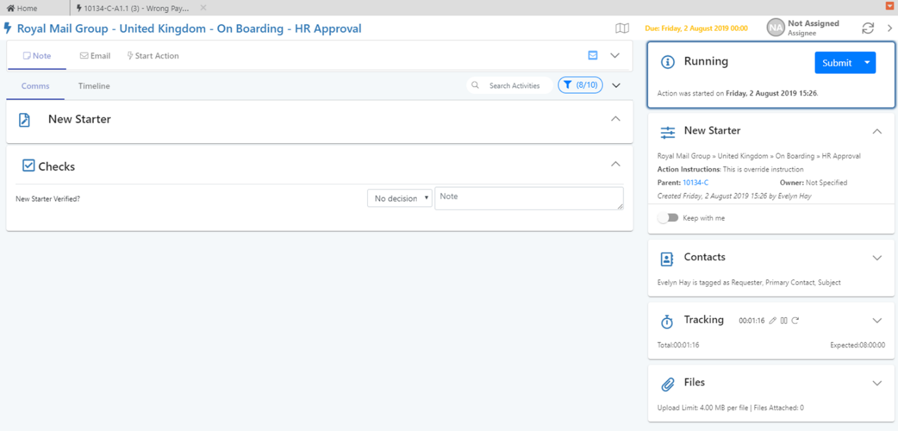

## A. Checklist Section

The checklist section on an Action shows the checks which are set for this Action as part of configuration in Builder.

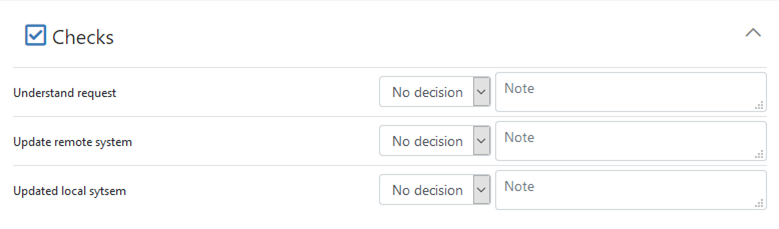

* In order to mark an Action as complete, you must confirm for each check:
  * Whether you have completed it \(Options are Yes, No, N/A\)
* Additionally, you can add notes for each check.

As normal, you can add notes into an Action Work Item from the Activities tab at the top of the main section.

## B. Processing an Action - Options



There are a number of options for how to process a running Action, i.e. different states to put it into as part of dealing with it.

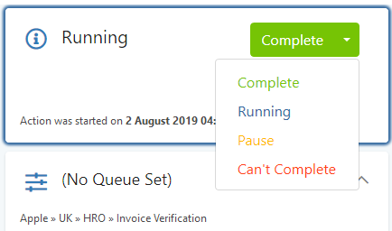

These are:

* Complete
* Set as Running
* Pause
* Mark as Can’t Complete

By default, an Action will normally be in a state of ‘Running’.

### Complete an Action

Select this when you have carried out the task. Once you have selected this, the Action will be closed and cannot be re-opened.

### Set as Running

Re-select this option if you wish to take the Action off Pause.

### Pause

Two types of pause are available:

**Wait for more information**

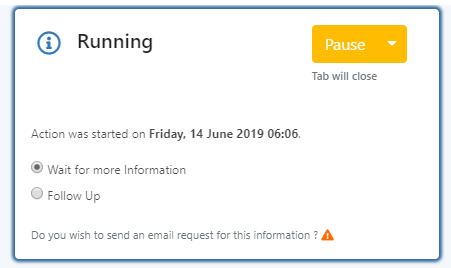

Use this option if you are waiting for additional information from the client. You do not _have_ to send out an email to contact but the system will provide a reminder message recommending this. Confirm by hitting ‘Pause’.Subsequently, when a response email arrives from the contact, the system will:

* Reassign the work back to the agent \(so it shows back in their Inbox, not just their ‘Owned Work’ list\).
* Highlight the work item in the inbox grid.

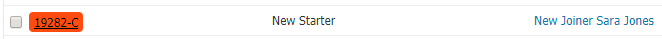

**Follow Up**

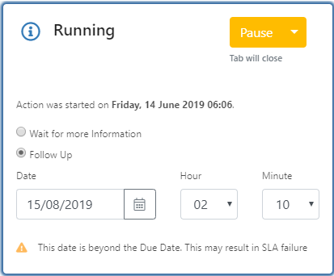

Use this option if you are simply wanting to follow up on the work item at a certain date and time. Fill in the datetime as desired and confirm by hitting ‘Pause’.

Subsequently, when the follow up date arrives, the system will reassign the work back to the agent \(so it shows back in their Inbox, not just their ‘Owned

### Mark as Can’t Complete

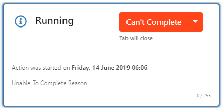

Set this option if you cannot complete the required activity. Once you have confirmed this option, the Action will be closed and cannot be re-opened. The Case Owner will be notified of this and be asked to take the necessary steps to resolve at Case level. This may involve starting another copy of the Action, reworking the Case from a previous step, or moving on.

Enter the reason you are unable to complete the Action and hit the ‘can’t Complete’ button to confirm. The tab will close.

## C. Peer Review Actions

For Peer Review-type Actions, after the activity has been completed by a user, the item is passed on to a different user to review. The reviewing user can then enter comments for each Checklist activity carried out, and then either approve or decline the Action.

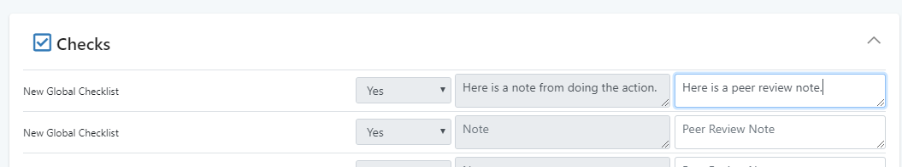

### Editing of Data by Peer Reviewers

When performing peer review on a work item, users are able to edit the data within the Action. This allows the reviewer to make some data changes as part of their review activity. There are only two types of data which remain read-only when being peer reviewed: the checklist confirmation dropdown, and the checklist completion notes.

## D. ‘Wait for Sub-Cases to Complete’ Actions

As the name suggests, once running, the ‘Wait for Sub-Cases to Complete’ Action will wait for all currently running Sub-Cases for this Case to reach completion before allowing the Case to close.

This will show to users on the Actions tab of the Case screen:

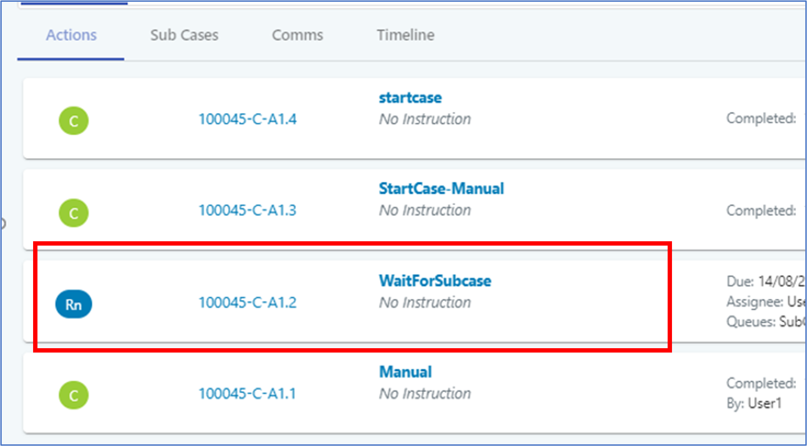

The status tab will also explain that the Action is waiting for Sub-Case completion:

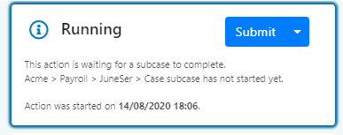

If you try to manually complete the Action, the system will display an alert message informing you that the main Case will no longer wait for sub-Case completion before it completes itself.

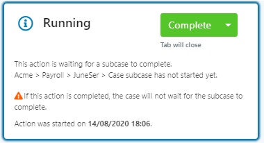

## 

