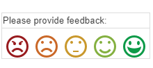
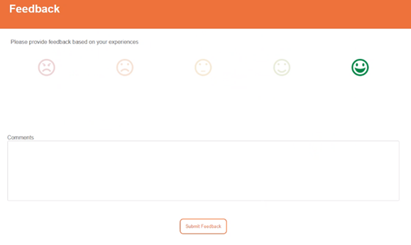
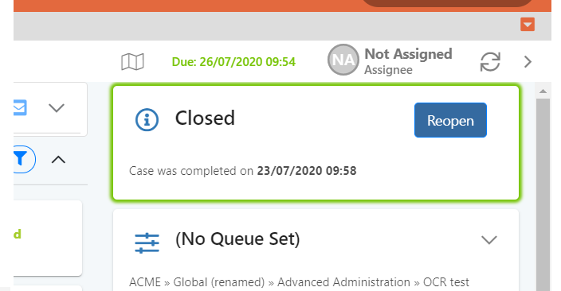

# 7.14 Customer Feedback Features

## A. Getting Customer Feedback via Email

If the ‘Requests Feedback’ setting is ticked for the Ticket category in Builder \(see Builder handbook for details of how to do this\), outgoing emails contain a footer-based link for recipients to give feedback scores

Once clicked, the Enate feedback form will be opened in a separate browser window_._ It offers the same feedback icons as the previous email but allows a user to change their selection should they wish, and also add an additional comment.

Once a user is finished giving feedback, they simply hit submit which closes the feedback window. Feedback data is subsequently stored, ready to be called upon by an agent from within the Ticket.

## B. Option to Reopen Cases during Feedback Window

Cases can be set with a feedback window \(e.g. 2 weeks\) allowing the requester some time within which to come back before the Case is fully, irrevocably, closed. During this period it is possible to reopen the Case.

* A Case will automatically re-open if \(during the feedback window\) an email is received or a Ticket is merged into it.
* A Case can manually be re-opened by a user using the “Reopen” button which presents on a completed Case which is within its feedback window.

The Feedback window for a Case is set in Builder as part of Case process configuration.

