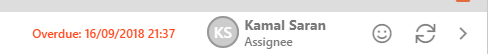
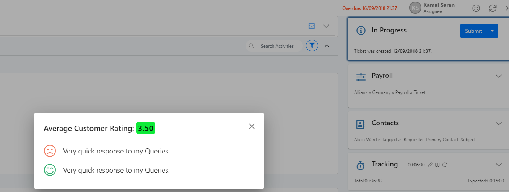

# 7.15 Displaying recent Feedback details via Work Items

When dealing with a work item, e.g. Ticket, agents can see the customer’s current feedback rating via a link in the ribbon bar:

Clicking on this will open a feedback popup displaying that person’s rating, _\(if they chose to enter one\)_ and an overall average rating, calculated from all recorded feedback items on a single work item.

## 

