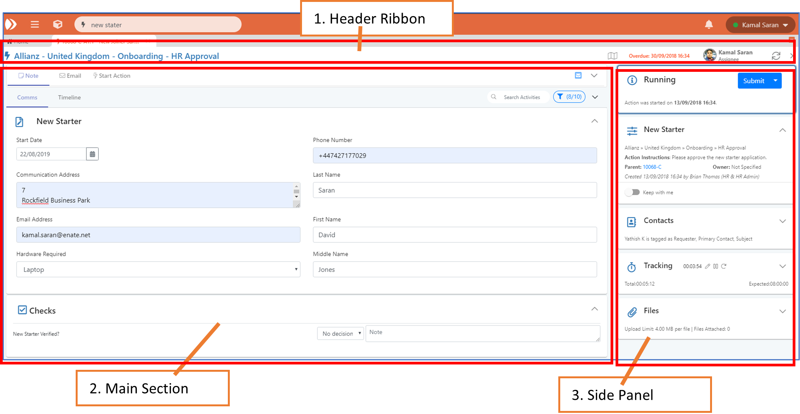

# 7.1 Overview of Work Item Types

There are three types of Work Item in Enate:

* **Cases** – Used for modelling multi-part activities \(i.e. business processes\).
* **Actions** – the constituent parts of a Case, i.e. a Case is made up of a flow of Actions. Contains a set of instructions, often a checklist of activities to track progress within the Action. These can be manual \(can be carried out by humans and bots\) or automatic Actions, e.g. auto sending an email.
* **Tickets** – Used for modelling single-part activities, e.g. queries. Tickets are standalone and are not part of a business process. Can be promoted to become a specific type of Case.



## A. Screens Overview

Work Item screens are made up of a number of collapsible cards which group together related information about that work item. There are a number of common features between Tickets, Cases and Actions and as such there is a single, consistent screen layout for all three \(with a small number of item-specific feature exceptions\).

The layout of the work item screens is composed of the following sections:

The sections in the screens are:

1. \*\*\*\*[**Header ribbon**](7.3-header-ribbon.md) – contains header-level information about the work item
2. \*\*\*\*[**Main section**](7.4-main-section-the-activities-tabs.md) – The main section to work out into. It contains:
   * Activities Tabs, allowing you to add notes, write emails, start Actions / sub-Cases.
   * Timelines section – Shows the activity for this work item in a chronological list. Filtered views allow you to see e.g. only the back and forth communications and notes. Actions are also displayed when looking at a Case.
   * \(Actions only\) – Checklists for the Action.
   * Smart Card can be configured to display custom data here \(See [Smart Cards](7.13-smart-cards.md) for more information\)
3. \*\*\*\*[**Side panel**](7.8-side-panel.md) – collapsible section with grouped information about the work item. A Smart Card can also be added here.


All cards are collapsible within their section but may be expanded by default when opening the work item.


