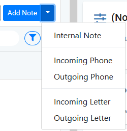

# 7.4 Main Section - The Activities tabs

The activities tabs contain some general sections available on all work items - Note and Email - plus specific ones for Ticket, Case and Action \(covered in specific sections\).

## A. Adding a Note

Click the Note tab to add a note.

After adding the note, the screen will refresh with the new note displayed on the timeline.

Please be aware: You do NOT have to have the work item assigned to you to add a note.

### Specifying note type

If desired, you can specify which kind of interaction resulted in the note, e.g. phone incoming / outgoing etc.

## 

