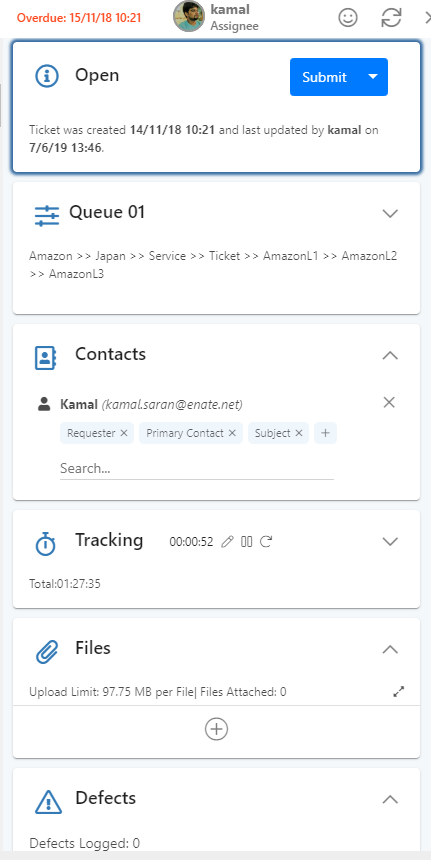
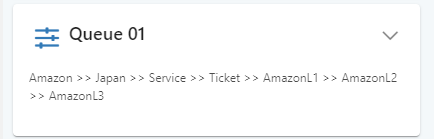
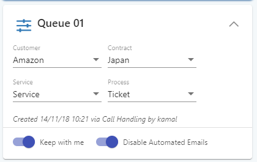
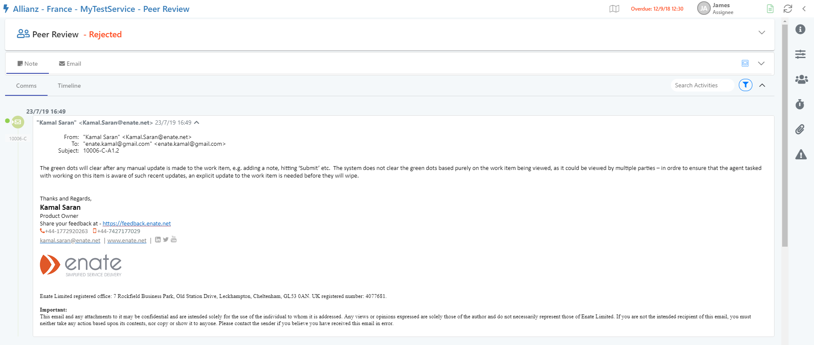

# 7.8 Side Panel

The right side of Ticket, Case and Action screens contain a number of expandable cards which display grouped data relating to the work item \(also shown collapsible\).

The following sections are displayed:

* **Info Card –** Shows overall status, allows status to be changed \(e.g. mark Ticket as ‘Resolved’\).
* **Settings Card –** Various settings
* **Contacts Card –** Shows the people who are involved with the work item.
* **Time Tracker Card –** Displays running clock of time spent accessing the work item.
* **Files Card –** Shows all files linked to the work item,
* **Defects Card** \(not displayed for Actions\) – Shows any defects which have been recorded during the running of the work item.
* Additionally, a Smart Card can be configured to display custom data \(See Smart Cards section for more information\)

When collapsed, the cards show a summary of information, read-only.

To view more detail / modify information, expand the card.

## A. Collapsing the Side Panel

You can collapse the entire side panel to give more screen space to the main section:

## 

