# 7.9 Individual Side Panel Cards

## A. Info Card

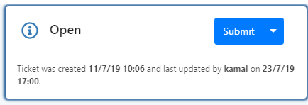

The Info card shows current overall status of the work item. Information you will find here:

See sections on Updating Ticket / Case / Actions Status for more information on this.  

## B. Settings Card

The settings card shows various detailed information for Tickets, Cases and Actions.

* Header shows the Queue that the work item is in, sub-header shows the Context, i.e. business that the work item is in \(Customer&gt;Contract&gt;Service&gt;Process\).

Other information displayed is specific to the work item type:

### Ticket

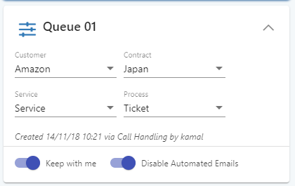

* Shows the Context \(Customer&gt;Contract&gt;Service&gt;Process\) for the Ticket, plus the Ticket category. These can be modified for a Ticket if you expand the card.
* Shows when and how / who created the Ticket.
* Options to keep the Ticket with current user, and option to not send out automated emails.

### Case

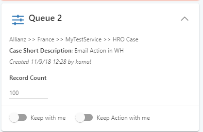

* Shows the Context \(Customer&gt;Contract&gt;Service&gt;Process\) for the Case. This cannot be modified after submission.
* The Case description text is shown. This cannot be modified after submission.
* Shows when created, and the parent work item, if there is one \(could be a Ticket or a Case\).
* Record Count \(editable\) – depending on configuration for the Case in Builder, the record count may or may not be displayed here.
* There are options to keep the Case with a currently specified user, and to also keep the Actions for the Case with the specified user.

### Action

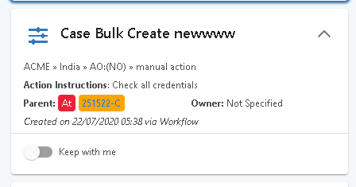

* Shows the Context \(Customer&gt;Contract&gt;Service&gt;Process\) for the Action. This cannot be modified.
* Show Action Instructions
* Shows the Status of an Action’s parent Case and has a link to the parent Case
* Shows when the Action was created and who by.
* Shows option to keep the Action with currently specified user.
* Shows if any new information has been received on the Case

## C. Contacts Card

The Contacts card is where you can specify the people who relate to the work item.

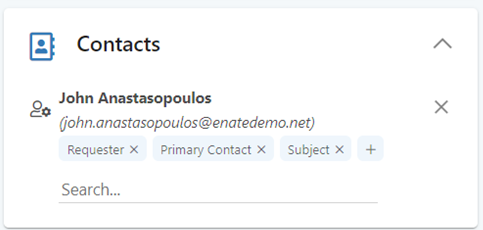

By default\*, the available relationships are:

* Primary Contact – the main person you are dealing with for this query.
* Requester – the person that raised the initial request.
* Subject – who the Ticket is about \(this may be neither of the above\).

Very often all three will be the same person.

* CCs – any further contacts which can be copied on any correspondence.

_\*It is possible to add further relationship types into the system if absolutely necessary. This is currently only possibly with direct scripting; however, a GUI will be available to do this in Builder in an upcoming build._

Some rules regarding the Contact section:

* Adding the Primary Contact and Requester is mandatory for Ticket.
* Depending on Case configuration in Builder, this may or may not be mandatory for Case \(if Set as mandatory for Case type, is also mandatory for that Case’s Actions\).
* Only one contact can be set as Primary Contact, as Requester, and as Subject. Multiple contacts can, however, be added as Ccs.

### The Contact Details popup

Clicking on an individual record will display the contact details information in a new tab showing the Contact Activity page.

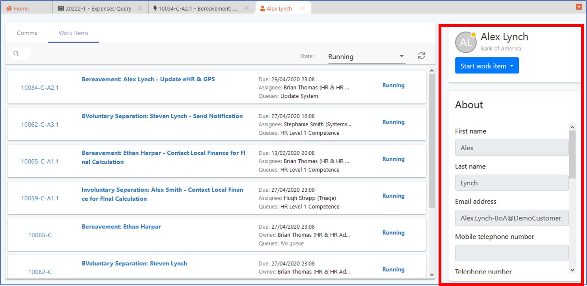

### Contacts populated from initial Email

When an email arrives from an address which is associated with a system user \(employee\) or an External Contact which has been previously recorded in the system then their details are automatically populated on the Contacts tab when the Ticket is created by the system. They will automatically be tagged as the Requester, Subject and Primary Contact.

These tags can be removed. Optionally the first operator to assess the Ticket can also set them as the Primary Contact if deemed appropriated by their assessment. If you tag another contact as any of these relationship types, the tag will be removed from the previous contact.

### Contacts populated from Contact Activity \(Call Handling\) Page

Similarly, when a Ticket is created from the “Launch Ticket” button on the Contact Activity page, the selected person’s details populate the Contacts tab and they are tagged as the Requester, Subject and Primary Contact.

### Searching / Creating Contacts manually

You can also manually add people to the Ticket. Free text search for them, and the system will propose relevant employee / external contact records to select from.

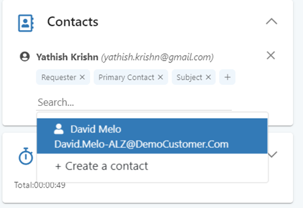

If the system cannot find any matching records then you can create a new contact by clicking on the ‘Create Contact’ link provided.

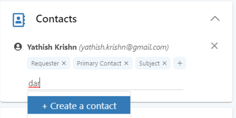

Fill in the resulting Contact Details popup \(at least the mandatory information\) to create the new contact record.

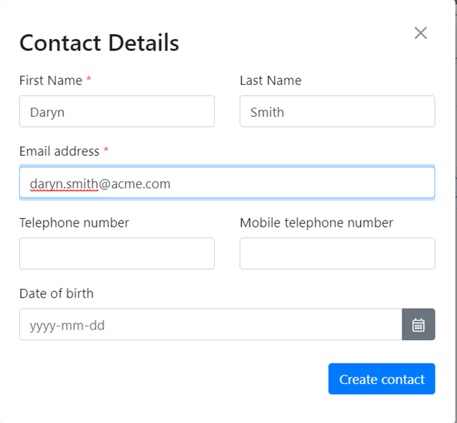

Alternatively, you can simply type the email address in full and hit enter. The system will automatically create a new record, setting email address, first name and last name.

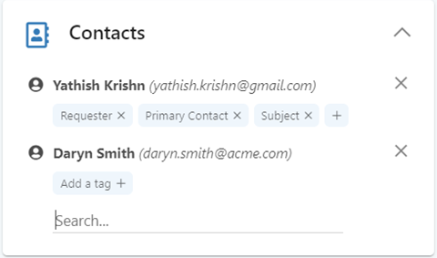

When you manually add a contact they will be set as the Primary contact, Requester and Subject by default. You can manually reassign these tags to other users afterwards.

When a contact is tagged only as ‘Cc’, it will be displayed in the separate Ccs section \(hidden until any Cc-only contacts exist on the Work Item\).

## D. Time Tracker Card

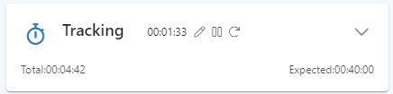

* You can pause, reset, or manually modify the value being recorded for the current session.
* An overall total of this and all previously recorded sessions for this work item is displayed.
* The system will also display the _Expected_ time required to complete the work item. This information can be configured in Builder against Actions and Ticket Categories. This information will only display if:
  * An Estimated Effort value has been entered for this Action / the selected Ticket Category in Builder.
  * The system-wide setting \(accessible via Builder\) to display estimated effort is set to On.
* Additionally, the system will always keep a record of the automatically recorded time \(i.e. not manually modified\). This is a record of the amount of time which the work item tab was displayed directly on screen. This data is not displayed to you but can be accessed for MI / reporting purposes.
* Please note that the time tracker tracks ALL accessing of the work item, even after it is completed.
* Manually editing the current time-on-task will save that modified time as a new row in the history. The ‘time on task’ box will subsequently display the auto-running count of the time since you started the manual edit of the previously displayed value.

### Previously recorded times

Expanding the Time Tracker card displays the recorded time for previous sessions.

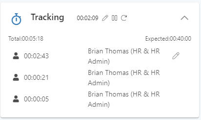

* If you are set as a Team Leader you can manually modify any historical values from a human user, even after the work item has been completed \(time tracker values for work performed by robots are read-only\). Note that the modifications to these values will be datetime-stamped and user-stamped for potential subsequent reporting purposes.

### When is time tracked / not tracked?

Time tracking runs whenever a user has the work item open and displayed on-screen, recorded against that user. If you have paused the tracker then the manually displayed value will not increment, however when running this is when it will increment:

| Scenario | What happens with the running counter |
| :--- | :--- |
| Open the Ticket up on screen - assigned to me / not assigned to me. | Counter is running. |
| Close the tab. | Counter Stops, any subsequent activity will start under a new session row. |
| User selects different Ticket tab in Enate for, e.g. 10 mins | Counter pauses while tab is not in focus. |
| User re-selects that Ticket tab in Enate | Counter starts again as part of same session. |
| Composing email for that Ticket in an email pop put; meanwhile the Ticket tab is still selected in main browser window | Counter is still running. |
| The browser is minimised, but Ticket tab is still the selected Ticket tab in browser window | Counter is still running. |
| PC is locked, but Enate was still running and that Ticket tab was still in focus | Counter is running, will stop upon session timeout. |
| User logs out of Enate session | Counter Stops. Upon logging back in, a new session row will be created. |
| The browser is closed unexpectedly / PC is closed unexpectedly / internet connection is lost | System will have a record of the most recently polled time \(within last 3 minutes\). Upon subsequent login, system will close off that row with that previously recorded time and will create a new session record. |

## E. Files Card

The files card will display a list of all files linked to the work item, including files attached to emails \(denoted with email icon\).

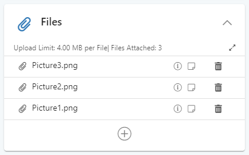

* You can manually add files \(multiple files can be uploaded at one time\).
* Notes can be added to the file upload by clicking the note icon. The icon will display in black if a note exists – click to expand.
* Manually added files can also be deleted if desired.
* All such files are available to add as attachments to any outgoing emails \(see email attachments section\).
* Datetime and Username of the person who uploaded the file \(or, if via email when it was received\) are also displayed.

### Tagging Files

Tags can be added to files in the File card of work items. The tag titles available to you are set up in the Builder app by your system administrator. This will allow you to bring better structuring to your files when mailing out information.

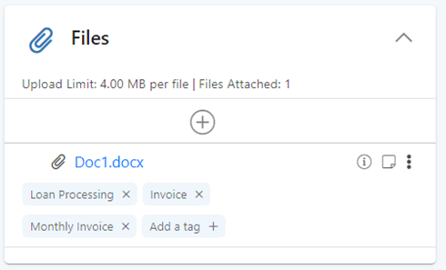

Once added, tags will display in the files card, and will make them relevant for auto-adding to emails with matching tags \(see [Auto-attachment of files to email content](7.5-composing-emails.md#c-attaching-files-to-an-email)\).

Tagging files is also an important feature for processes which involve automation technology. Example: if a downstream automated Action needs to know which of the files you’ve attached to your Case is the ‘Invoice Confirmation’ file, you can tag the relevant files as such and, no matter what the file name, the automation technology would know to select that file based on its tag.


Note: If file tages are not configured in your system then this ‘add file tag’ option will not be displayed.


### Auto-attachment of Files to inserted Email Content with matching Tags

When a canned response text is inserted into a manual email or when a new email is created in-process, the system will identify any tags linked to the canned text / email template and will then auto-attach all of the work item’s files which share the same tag. Tags are linked to the canned response / email content as part of system configuration by administrator users in Builder.

### Select and Edit multiple Files in Files Card

A select option is available in the Files section when multiple files are loaded. Upon selecting this, download and delete options are displayed to allow you to download / delete one or more files.

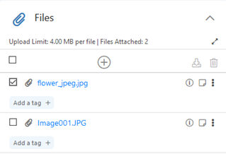

The delete option is hidden when an email attachment is selected.

### Preview Of Attachments

The document previews will open in a new tab.

* Attachments in the files card can be previewed by clicking on the preview option

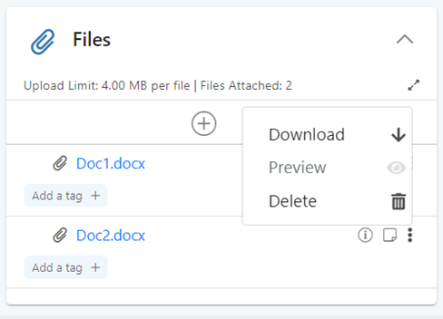

* If the file is not previewable, a confirmation banner will pop up to explain this, and to offer an option to download the file.

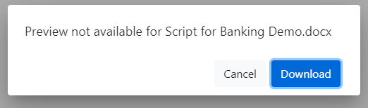

* The file types supported for preview are as follows: **txt**, **pdf**, **jpg**, **jpeg**, **jpe**, **jif**, **jfif**, **jfi**, **png**, **gif**, **web**, **tiff**, **tif**, **heif**,**heic**, **svg**, **svgz**.

### Drag and Drop of Attachments into Email Section

The functionality enables users to drag and drop attachments into the **Files Card**. When attachments are dragged into the **Files card** section, the section is highlighted with a green border.

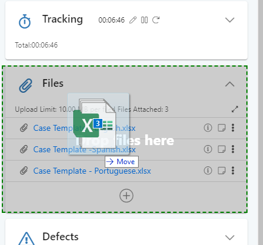

## F. Defects Card

The Defects section provides the functionality to record defects for the corresponding Ticket, if anything has gone wrong in the process. These can be included in MI/ Dashboarding to identify areas of the business which need to be investigated.

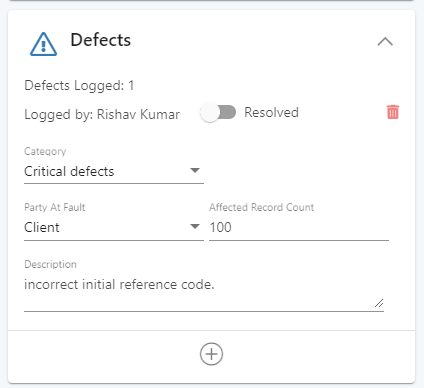

* The ‘Party at Fault’ dropdown captures who was at fault for the occurrence of that defect. User can select whether an Agent was at fault, the Service Centre was at fault or whether it was because of the Client.
* If a defect gets resolved, then User can open the specific Ticket and its defect, and mark it resolved.
* Defects can be deleted while the work item is in progress.
* The Defects card is NOT available for Actions.

