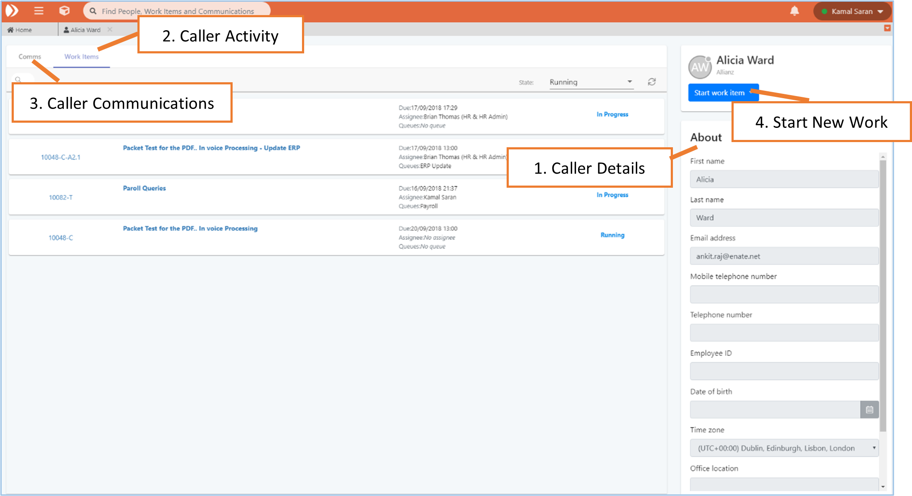
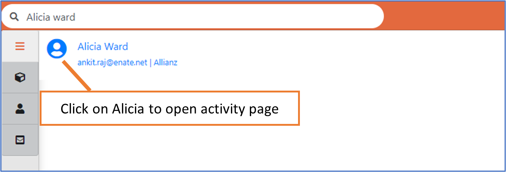
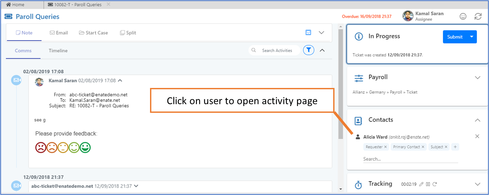

# 9. Contact Activity Page

The main sections on the Contact Activity page are as follows:

1. **Caller Details** – This section allows you to update contact details of the searched caller and subsequently refer to their user details .
2. **Caller Activity** – Displays all system activity \(work items\) which relate to the caller. Each work item is shown as a card with data about it like Reference, Title of work item, Due Date, Assignee, Queue, and state. Work Items can be opened for further details by clicking on reference and title. Running items are displayed by default, completed packets can also be displayed.
3. **Caller Communications** – Displays communications relating to the user and the packets in the activity section \(notes and incoming / outgoing emails\). Free text searching is available here to locate specific communications – searches against email body text.
4. **Start New Work Item** – Allows call taker to start a new piece of work for the caller. Links are auto-generated here when a Ticket or Case is set live in Builder and has the ‘Show in Contacts’ setting ticked.

## A. How to navigate to the Contact Activity page

You can reach the Contact Activity page via:

**1. Quickfind** – when you search for a user in Quickfind and then click on that user, the system will open the Contact Activity page of that person.

**2. Work Item**– when you are in the middle of processing a work item and would like to know more detail about a contact, navigate to the Contact card and click on the contact to open that person’s contact activity page.

You can also create a new contact from a Work Item. When you search for a user who does not exist in the system, clicking on ‘Create a Contact’ will allow you to create the contact.

The System will decode and autopopulate first name, last name and email address. Once you fill in all the information and click on create contact, the system will redirect back to the work item.

