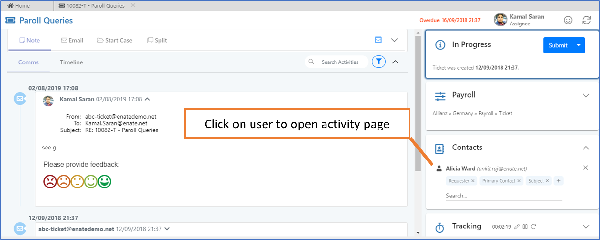

# 9.1 How to navigate to the Contact Activity page

You can reach the Contact Activity page via:

**1. Quickfind** – when you search for a user in Quickfind and then click on that user, the system will open the Contact Activity page of that person.

**2. Work Item**– when you are in the middle of processing a work item and would like to know more detail about a contact, navigate to the Contact card and click on the contact to open that person’s contact activity page.

You can also create a new contact from a Work Item. When you search for a user who does not exist in the system, clicking on ‘Create a Contact’ will allow you to create the contact.

The System will decode and autopopulate first name, last name and email address. Once you fill in all the information and click on create contact, the system will redirect back to the work item.

