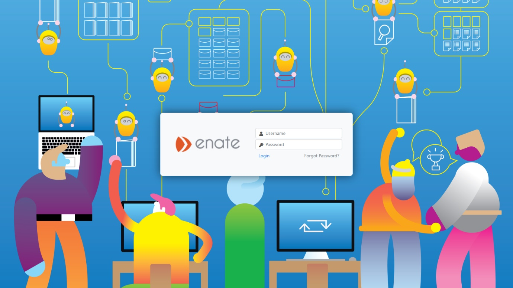

# Introduction to Work Manager

Work Manager is a web-based application used by members of the Service Delivery team to interact with Tickets, Cases and Actions running through managed business processes.

Users of Work Manager are Service Agents, Team Leaders, Operations Managers and Executives. Work Manager provides a standard set of views for these users to carry out work.

