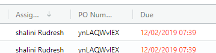
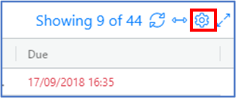
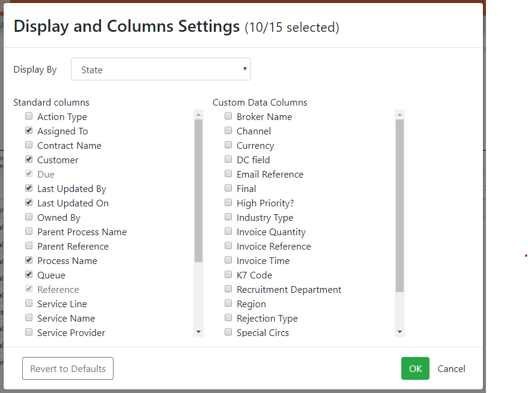
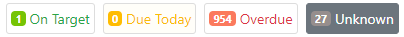
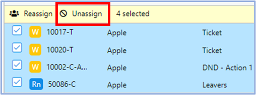

# 1.1 Home Page – Bar Chart and Grid



## A. Home Page Grid

### Grid Display Options

You are able to filter which Work Items you can see on the Home Page by selecting Inbox, Owned Work, My Team Inbox, or My Team Owned Work.


Note: The RAG volumes and bar charts are shown independently for each of these views, and so the displays of each will also change when you flip from one grid view to the other.


#### Inbox

The Inbox view shows you which work items are currently assigned to you.

#### Owned Work

The Owned Work view displays work items for which you are the Owner, rather than the current assignee. These are work items which may not necessarily be assigned to you \(or anyone\) right now, but for which you have longer-term responsibility for, e.g. Cases.

Long Term responsibility refers to the person responsible for the entire Case journey . This includes its Actions, the status changes of Cases and Actions and the delivery of the process.

* A Case can be owned by using Keep with me
* Actions have an owner-only in case of Pause State i.e. Wait for more information, schedule for follow-up
* There can be only one owner of a Case at any one point

#### My Team Inbox

The My Team Inbox view shows you all the work items which are currently assigned to your Team.

#### My Team Owned Work

The My Team Owned Work view shows you all work items that are owned by your Team i.e. Cases started by them, Wait for more information, Schedule for follow up, etc.


Note: If you are a Team Member who prefers a focused view of your Inbox and you do not want to see the Peers and Queue work, then please ask your manager to switch off these views for you. Your view after login will then only show items in your Inbox / Owned Work.


### Displaying Additional Grid Columns

The Team Grid Settings popup in the Home page \(entitled ‘Display and Column settings’\) offers a number of additional features for grid columns and bar chart grouping:

#### Standard system attributes as Columns

The list of standard system attributes you can display as grid columns which are available in the Home page grid, the Inbox grid and the Owned Work include :

1. **Action Type** – this shows the Action type either as send email or as a manual Action.
2. **Assigned To** – this shows who the Action has been assigned to.
3. **Contract Name** – this shows the name of the contract.
4. **Customer** – this shows the name of the customer.
5. **Due** – this shows when the action is due.
6. **Last Updated By** – human/digital worker who updated this item last time.
7. **Last Updated On** – datetime when this item was last updated by a human/digital worker. The datetime on which custom data field values are updated is stored in the Enate database and can be used for subsequent reporting.
8. **Owned By** – name of the user who currently has ultimate responsibility for the work item.
9. **Parent Process Name** – if this an Action, this shows the parent Case.
10. **Parent Reference** – Reference number of the work item which started this one, e.g. parent Case**.**
11. **Process Name** – the business process the work item is part of, e.g. ‘Maternity Request Process’.
12. **Queue** – the work Queue which Cases/Tickets/Actions get sent to based on their routing rule.
13. **Reference** – unique reference number e.g. 101342-T.
14. **Service Line** – the overall area of the business this work item runs under, e.g. ‘Payroll’.
15. **Service Name** – the service instance the work item runs under, e.g. ACME French Payroll.
16. **Service Provider** – the company delivering service for this work item, usually _your_ company.
17. **Started** – this shows when the Action was started.
18. **Started By** – this shows who the Action was started by.
19. **Started By Method** – how the work begain, e.g. incoming email, automatic schedule, manually.
20. **State** – current state of the work item e.g. Running, Waiting for more Information, Resolved etc.
21. **Ticket Category Level 1** – High-level categorisation of type of Ticket e.g. ‘Healthcare Request’.
22. **Ticket Category Level 2** – e.g. ‘International Travel Coverage’.
23. **Ticket Category Level 3** – Most detailed-level categorisation e.g. ‘Eligibility Query’.
24. **Time Remaining When Paused** – the amount of time left before the due date at the point the item was placed into a paused state.
25. **Title** – a brief text description of the work item, often the subject of the original email.
26. **Work Item Type** – i.e. Case, Action or Ticket.

#### Custom Data fields displayable in Work Manager grids

Custom Data fields which you create in Builder can be selected as additional columns in the Home page/Inbox/Owned Work grids. Fields of all data types can be used with the exception of: Table fields and Long Text fields.

In the Grid Settings popup of the Home page, selecting a field from the Custom Data Columns options in the ‘Team Grid Settings’ popup...

...will add this field as a column in the grid.

**Moveable Grid Columns**

Grid columns can be reordered and resized within the Work Manager grids as desired.

All displayed columns can be used as grid sort criteria and the free text filter available for the grid will also apply to these criteria.

### Grid Filtering

#### **Via Chart / RAG Display**

* Clicking on any of the header-level volume RAG filters will filter the grid results to show only those items \(e.g. only overdue items\). Unclick to remove filter
* Clicking on Bar name within the chart, e.g. ‘HR Queue’, filters grid to those results
* Clicking on a specific R/A/G section within an individual bar filters grid results down to items in that state for that e.g. Queue

**In-grid filtering**

* Free text search of grid information is available. Simply type in the box provided. The totals at the top right of the grid will show the total number of items in the grid and, when filtering, the number of filtered items from that total.
* Any filters in play on the grid are displayed at the top of the grid and can be individually removed to adjust grid display results.
* Make column order in search grid persist when doing multiple searches. Once you add a column and order preferences to their search grid, these settings will persist when you logs back in.

### Additional Grid Features

* Click on an underlined hyperlink to open that work item.
* Column widths can be manually adjusted, and data sorted by a given column - click on the column header to sort by that column. Click again to cycle though ascending, descending and no sort.
* The Team Grid Settings \(accessible via the dropdown caret in the grid header\) allows you to adjust which columns to display \(some of these are mandatory, displayed in grey\). You can also revert the column settings to default if you wish.

## B. Home Page Bar Chart

Bar Chart information is displayed in a Pareto format, i.e. with highest volumes shown first. A maximum of ten bars are displayed. The top nine groups are displayed uniquely, with all remaining items shown combined in the final bar.

### Bar Chart ‘Group By’ Options

The ‘Group Chart By’ choice for the bar chart at the top of the Home page is accessed via the grid settings link.

This will display the Team Grid Settings, used primarily for showing the column options. At the top of this screen the relocated ‘Display by’ setting can be found.

This includes further system attributes as well as Custom Data fields.

#### System Attributes to group by

The system information by which you can group the bar chart display is as follows:

1. **Action Type** – this shows the Action type either as send email or as a manual Action.
2. **Assigned To** – this shows who the Action has been assigned to.
3. **Contract Name** – this shows the name of the contract.
4. **Last Updated By** – human/digital worker who updated this item last time.
5. **Last Updated On** – datetime when this item was last updated by a human/digital worker. The datetime on which custom data field values are updated is stored in the Enate database and can be used for subsequent reporting.
6. **Owned By** – name of the user who currently has ultimate responsibility for the work item.
7. **Parent Process Name** – if this an Action, this shows the parent Case.
8. **Process Name** – the business process the work item is part of, e.g. ‘Maternity Request Process’.
9. **Queue** – the work Queue which Cases/Tickets/Actions get sent to based on their routing rule.
10. **Service Line** – the overall area of the business this work item runs under, e.g. ‘Payroll’.
11. **Service Provider** – the company delivering service for this work item, usually _your_ company.
12. **Started By** – this shows who the Action was started by.
13. **Started By Method** – how the work begain, e.g. incoming email, automatic schedule, manually.
14. **State** – current state of the work item e.g. Running, Waiting for more Information, Resolved etc.
15. **Work Item Type** – i.e. Case, Action or Ticket.

#### Grouping by Custom Data Fields

All Custom Data fields of the following types can be used as grouping criteria for the bar chart:

* Short Text
* List \(simple list only\)
* Checkbox


Note: When you choose to group the bar chart by a certain item \(system property or Custom Data field\), that item will be added to the main grid display as an additional column. You can return to system defaults to show the standard list of columns in the grid, and back to grouping by Queue.


## C. Due Date Totals \(Red / Amber / Green / Unknown\)

Work Items are classified into their respective due states:

* Green – Not yet overdue
* Amber – Due today \(but not yet overdue\)
* Red – Items which are now overdue \(even including items where the due date is today, but the due _time_ has now passed\).
* ‘Unknown’  - Work Items are classified into a state of Unknown when the Due Date is not currently known. This can be in the following situations:
  * When the work item has just been started \(manually\) but has not yet been submitted
  * When the work item is in a state of ‘Paused – Wait for more Info’ AND is set to add the wait time on the Due Date

## D. ‘Pull from Queue’ button

Clicking on the 'Pull from Queue' button in the Inbox grid header will assign you a new piece of work.

The following rules are used for determining the work item to give you:

* Any work item currently unassigned which is sitting in a Queue that you work out of will be considered. 
* The work item which is _due soonest_ will be assigned to you, and will be automatically opened up on a new tab on screen. 
* If there is no unassigned work available in Queues you work out of, the system will then consider any further unassigned work which you have permissions for.

## E. Bulk Assign / Reassign / Unassign

### Bulk Reassign

You can select one or more work items \(using the checkboxes in the Inbox / Owned Work grid\) and then reassign them to other members of your team. Additionally, you can add a note while doing this reassignment. 

#### **Reassign Work Item to a Bot**

If a work item can be done by a robot, you can also choose to reassign the item to any individual bots that are in your team. 

You can also make that reassignment choice at the farm level by selecting ‘Any Bot within \[farm name\]’. The system will then automatically assign the work item to one of the bots in the farm.

### Bulk Unassign

In addition to being able to assign items in bulk from grids, you can select to bulk _un_assign multiple work items.

This unassigns the work items, which then become available for users to Pick up from their work Queue. Users no longer need to navigate into the individual work item in order to unassign.

