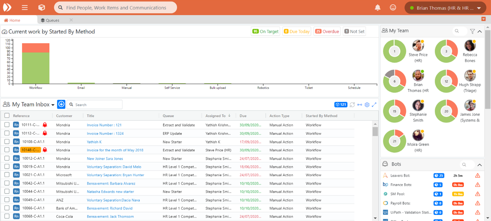

# 1.3 Team Bar



On the right hand side of the Home page is the Team Bar.

### Team Säule:

Auf der rechten Seite der Homepage befindet sich die Team Säule:

Dieser Abschnitt zeigt Ihnen:

* **Mein Team** - Die Leute in Ihrem Team und, für jeden von ihnen:
  * Die Menge an Arbeit, die sie noch zu erledigen haben \(Zahl in der Mitte des Diagramms\)
  * Die Fälligkeit dieser Arbeit \(d.h. Rot/Gelb/Grün\)
  * Ihr aktueller Verfügbarkeitsstatus \(online oder offline\)
* **Bots** - Alle Roboter, die verfügbar sind, um an Aufträgen zu arbeiten, die Sie verwalten / mit denen Sie arbeiten, gruppiert nach Roboterfarm:
  * Jede Roboterreihe zeigt eine andere Roboterfarm zusammen mit ihrer Technologie \(z.B. UiPath, Automation Anywhere, Blue Prism usw.\). Die Anzahl der für die Roboterfarm aufgereihten ‘‘erfüllbaren’’ Arbeitsaufträge wird angezeigt, sowie die geschätzte Menge an Arbeit, die für die Roboterfarm in Minuten verfügbar ist.
  * Wenn einer der Roboter in der Farm offline ist oder nicht reagiert, wird ein Warnsymbol angezeigt
* **Nicht zugewiesene Arbeit** - Sie können den Umfang der Arbeit sehen, die in den von Ihnen verwalteten Warteschlangen am Fuß dieses Abschnitts, gruppiert in jeder Warteschlange, nicht zugewiesen ist. Auch hier ist der RAG-Status \(Rot, Gelb oder Grün\) dieser Arbeit zu sehen. Wenn Sie überfällige, nicht zugewiesene Arbeiten haben, d.h. rote Punkte in diesem Abschnitt, sollten Sie daran arbeiten.

Sie können die Anzeige Ihrer Teammitglieder nach verschiedenen Kriterien sortieren:

* Am wenigsten / meisten Arbeit \(gesamt\)
* Am wenigsten/meisten überfällig \(gelb\)
* Am wenigsten/meisten überfällig \(rot\)
* Am wenigsten/am meisten auf Kurs \(grün\)

Sie können dies verwenden, um Mitarbeiter, die überlastet sind, und andere Teammitglieder zu identifizieren, mit denen Sie die Arbeit unter sich aufteilen können, um die Arbeitsbelastung auszugleichen

* Sie können die angezeigten Nutzer filtern, um diejenigen zu sehen, die ein/aus/beides getaktet sind
* Die Freitextsuche ermöglicht Ihnen die Suche nach einzelnen Benutzern aus der Liste

#### Online- / Offline-Status für Teammitglieder

Der für Benutzer angezeigte Status ‘‘Eingeschaltet’’ / ‘‘Ausgeschaltet’’ wurde durch eine Markierung ‘‘Verfügbar / Offline’’ ersetzt. Diese neue Einstellung zeigt an, ob die betreffende Person derzeit im System ist online. \*

**Wie funktioniert das?**

Das System verfolgt Ihre aktive Enate-Browser-Sitzung und kann so überprüfen, ob sie noch bei Enate angemeldet sind.

_Hinweis: Wenn Sie sich nicht ordnungsgemäß abmelden, d.h. den Browser oder Rechner direkt herunterfahren, ohne sich von Enate abzumelden, zeigt das System Sie für die Dauer der Standard-Systemzeitüberschreitung \(normalerweise 30 Minuten\) als noch online an._

Ein wichtiger Punkt ist, dass dieser Online-/Offline-Status nur zu Informationszwecken dient - er wird nicht als Teil der Vergaberegeln berücksichtigt - d.h. die Einstellungen 'An wen geht es?

**Teamanzeige nach Verfügbarkeit filtern**

Der Ansichtsabschnitt 'Mein Team' ermöglicht es Teamleitern und -Mitgliedern, die Anzeige ihres Teams so zu filtern, dass nur verfügbare / nur offline / alle Benutzer angezeigt werden.

#### Teamleiste für Teammitglieder - Teamleiste ein-/ausblenden

Wenn Sie ein Teammitglied sind, sehen Sie den Abschnitt ‘‘Bots’’ nicht in Ihrer Teamleiste, sondern nur den Abschnitt ‘‘Mein Team’’ und den Abschnitt ‘‘Nicht zugewiesene Arbeit’’.

