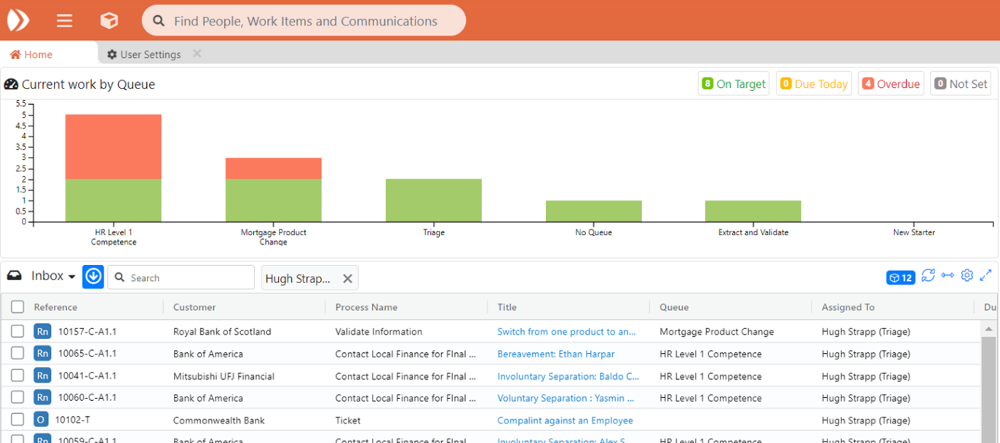

# 1.4 Viewing an Individual User

* Clicking on an individual user in the Team bar swaps out the bar chart main display to show the user profile AND filters down the grid results to show only work items currently assigned to that user
* On this view Team Leaders can view and modify the user’s ability to:
  * Create work in business areas they have permissions on
  * Reassign work they have permissions on
  * See their ‘Peers and Queues’. This will allow your team members to see work which their peers are doing, and upcoming workload in their Queues
* The view can be closed to return to the standard bar chart view of all work items


Note: for Team Members, other team members’ profiles do not display, instead a bar chart of that other team member’s work shows.


## 

