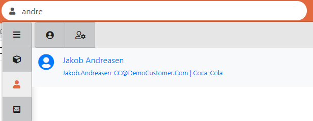

# 3. Quickfind

You can use Quickfind to search for People, Work Items and Communications.



By default, Quickfind will search against all three categories of Work Items, Communications and People, but you can focus down to searching just one of these categories by selecting from the left-hand dropdown in the Quickfind header.

## A. Searching Work Items

* Search against Work Item Reference, Title, Process Name
* Work item search results will display Reference, Title, Process name, current status \(with Red/Amber/Green colour-coding\), plus the name of the person to whom the item is currently assigned.
* Clicking on a Ticket / Case will open that work item in a new tab.

**Additional filters:** Additionally, you can filter the search by start date \(from Today through to Past Year, plus specific date ranges\) using the slider provided and can filter out by work item type i.e Case, Ticket and Action by clicking in top icons.

**View more results:** By default, the system will display the top 20 results. See further results by clicking the ‘Show More’ link at the foot of the results.

**‘Quick Grab’:** Hovering over a work item row in Quick find will display a ‘Take It’ icon. Instantly assign this work item to yourself by clicking on this icon.

## B. Searching Communications

* Search against email Subject, Body text and contact details \(To, From, Cc, Bc\)
* Email results display To/From address \(depending on whether incoming or outgoing\), title and first few lines of email body. Additionally, email sent / received time.
* Clicking on email will open the work item which is linked to that email in a new tab.
* You cab additionality filter out by communication type i.e. incoming email, outgoing email, note, self-service comment by clicking on top icons.
* You can also use the slider to filter by received / sent date \(from Today through to Past Year, plus specific date ranges\).

## C. Searching People

* Employees can be searched for using First name, Last name, Company and Email Address.
* Additionally, further people-extended properties can be added to the system and all text/string properties can be searchable within Quickfind.  For example, you might have a 3rd party contact with the attributes ‘Country Name’ etc. which will be searchable in the Quickfind.
* The criteria which can be searched against, e.g. ‘Employee Number’, are displayed as the records are returned in the Quickfind results, in the line underneath the contact name.
* Clicking on a person will open the Contact Activities page \(previously called the ‘call Handling’ page\) where you can view current and historic activity - work items related to that person - all their communications, and start new work for them.
* If you have many results, then you could filter it by clicking on ‘Contact’ or ‘Agent’. When you click on contact, the system will only show contacts with search criteria.

### **Creating a new Contact Record from Quickfind**

If you are searching for a new contact which does not currently exist in the system, you can create a new contact from Quickfind itself. Navigate to people search in Quickfind and click on ‘add a contact’

When you click on ‘add a contact’, the system will decode and auto-populate the first name, last name and email address. Once you fill all information and click on create contact, it will navigate to the Contact Activity Page of the User.


Note: The contact email address must be unique in the system.


