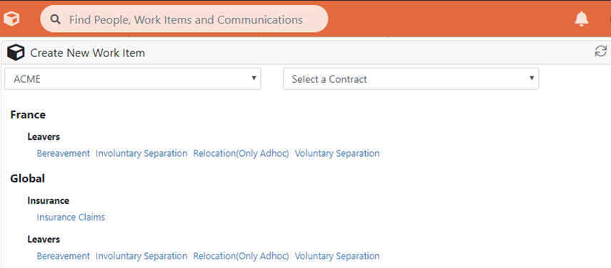

# 6. Creating New Work

Work can be created by users from within Work Manager in two ways:

1. **From Create New Work Item.** This is a dropdown available from the toolbar, the agent selects a Case or Ticket to start under a specific business context
2. **From the Contact Activity page**, often also referred to as the Call Handling Page. From this page, the service agent would first search for and find a person \(often someone calling in to the service centre\), and then start a piece of work directly for them, i.e. a Ticket or a Case

## A. Creating New Work Item from the ‘Create New Work Item’ dropdown

You can create work by clicking on the ‘Create’ link in the header bar \(cube image\). This will produce a dropdown screen section allowing you to start a new work item.

For users with access to multiple customers, dropdown displays at the top of the screen allow you to filter by Customer and Contract.

Input links automatically appear here for Tickets and Cases when you have created a Ticket or Case process in Builder and set it to Live.

Clicking on a link will create the new work item in a separate tab.


Note: When running in Test Mode, processes which are in a state of ‘validated draft’ will be displayed here


## B. Creating New Work Item from the Contact Activity page

You can create work by clicking on the 'Start New Activity' dropdown on the [Contact Activity page](9.-the-contact-activity-page.md).

Standard naming convention is now:

* Customer – Contract – Service – Process

If you are on a contact page for someone under a known company \(i.e. scoped at customer level\), the Customer information will not display in this link name

A free text search will allow you to filter this list of links

Administrators can control whether you wish to see the Input link for a given Ticket / Case process via settings in Builder

