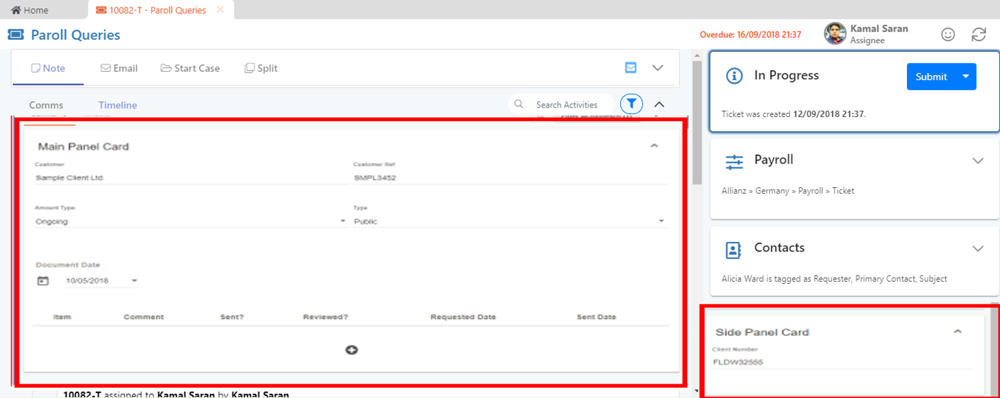
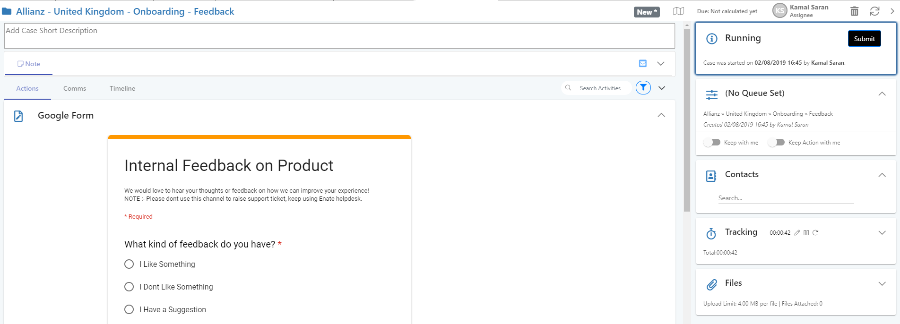
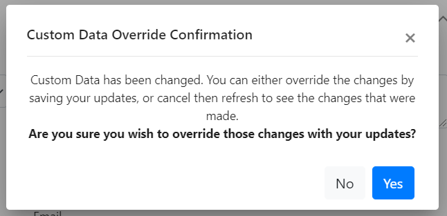

# 7.5 Smart Cards

Custom Data can be added to Tickets, Cases and Actions to capture bespoke information on these work items as they run through process. The information is displayable via Smart Cards. Cards can be set to display in the main section of the work item, and also as a section of the side panel on the right side of the screens.

These cards can be designed \(with HTML, Typescript and CSS\) to surface almost any content, e.g. content from other systems.

## A. Validation in Smart Cards

Smart cards can be linked up to standard system validation in order to e.g. make filling in of certain data on a card a requirement before you can progress a work item.

## B. Custom Data Override Warning

If you have a work item open and are modifying custom data, Enate will check for any data conflict when you go to update the work item. Specifically, a check will be made to see if another user has accessed the work item and changed any of its custom data since you opened it. If so, a confirmation message box will be displayed to you asking whether you wish to proceed with your update \(which will override their changes\) or instead cancel and refresh your screen to see \(and keep\) those latest changes.

