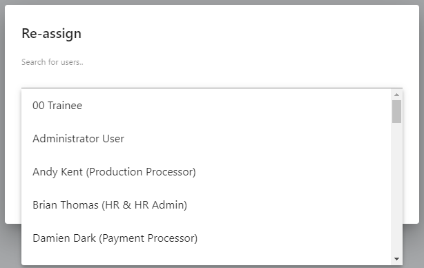

# 7.2 Header Ribbon

Along the top of the Ticket Case and Action screens is a header ribbon of relevant information.

You will see the following information in the bar:

* Title
* Case Progress \(Case and Action only\)
* Due Date
* Assignee
* Standard Operating Procedure Link
* Current User Feedback link \(Ticket only\)

Also displayed on the ribbon as the delete, refresh and collapse side bar icons. 

Items are only deletable up to the point of initial submission. After this point they cannot be deleted in this way.

## A. Title

* Depending on Builder settings, this may be editable throughout the duration of a Ticket.
* For Cases this is editable when initially creating the Case, but read-only after that point.
* Title is automatically set when creating an Action and is not editable.

## B. Case Progress \(Case and Action only\)

Clicking on the map icon will bring up the Case progress popup. This displays the steps in the Case and highlights the current step \(in orange\). Completed steps and future steps are also displayed.

If you do not want any percentages to show here, simply leave them blank when configuring the Case’s steps in Builder.

## C. Due Date

The work item due date will display, colour-coded to show if the date has been missed. If Builder configuration allows the Due date to be modified, simply click on the Due Date to bring up a popup allowing you to modify.

## D. Assignee

### Item Access vs. Assignment - Rules

The system works as follows with regards to work item access:

* If the work item is assigned to you, you can work on it as normal.
* If the work item is not assigned to anyone, you can start to work on it without worrying about assignment. As soon as you start to do any activity which requires assignment, the system will automatically do this \(i.e. you do not need to manually set yourself as the assignee\).
* If the work item is assigned to a different user, the system will display a short message when opening the work letting you know this. Click the ‘Take it’ grab icon to instantly assign the work item to yourself.

* Note that some activities can be performed even if the work is not assigned to you:
  * Adding a Note
  * Sending an Email
  * Adding an Action while in a Case

You can perform these even if the work is assigned to someone else, since they are purely additive.

## E. Reassigning work

If you wish to change the assignee for the work item, click the dropdown.

Options are:

* Assign to me \(if it is not already\)
* Reassign to a different user. A popup will display; you can search for a user to assign work to and add a note to go along with the assignment. A notification message \(including the note\) will be sent to the new user.

* Unassign. This will simply clear the assignee name. If the work item is in a Queue, it will now be available for automatic assignment when a user hits ‘pull from Queue’ from their inbox.

## F. Alerting users when work is assigned to someone else

If you open an unassigned work item and subsequently make a change which would result in it being auto-assigned to you, if during the interm period another user has opened the same work item and has already assigned to themselves, the system will display a warning popup explaining that if you assign the work to you, any unsaved changes from the other user will be lost.

You have the choice to continue with assigning the work to you \(which will discard the other person’s unsaved changes\) or cancel your reassignment / update.

## G. Ticket Feedback Link

The 'Follow Up' settings for a Ticket category in Builder allows you to switch on Feedback. This will result in:

* Feedback links being displayed in emails to customer which link to a feedback form you can fill in.
* Your current feedback rating will display in the ribbon on Work items for them, with link to show the recent feedback they have given.

