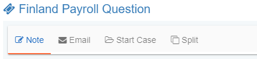
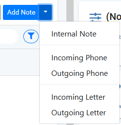
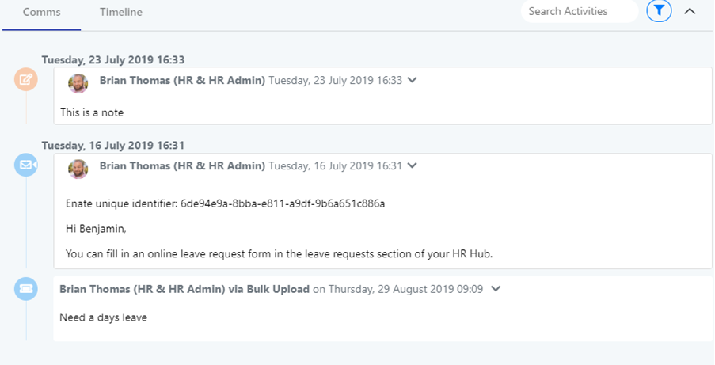
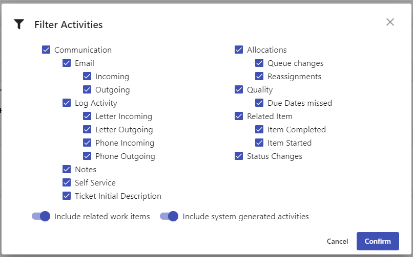
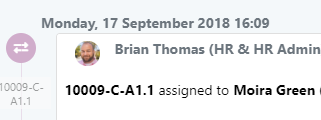
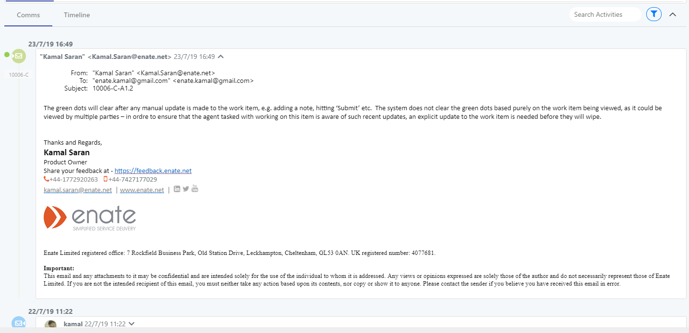

# 7.3 Main Section

## A. Activities Tab

The activities tabs contain some general sections available on all work items - Note and Email - plus specific ones for Ticket, Case and Action \(covered in specific sections\).

### Adding a Note

Click the Note tab to add a note.

After adding the note, the screen will refresh with the new note displayed on the timeline.

Please be aware: You do NOT have to have the work item assigned to you to add a note.

#### Specifying note type

If desired, you can specify which kind of interaction resulted in the note, e.g. phone incoming / outgoing etc.

#### Closing an item with incomplete notes

If you have started to enter a note but have not saved it, the tab will display a ‘\*’ marker on the tab alerting you to this.

If you subsequently try to close the work item tab with this ‘in-progress’ items still unsaved, the system will alert you asking if you wish to proceed.

## B. Timeline Section

The timeline section shows activity that has taken place in the work item \(and related items\), with most recent updates shown at the top of the timeline.

You can expand items to view them in more detail. The most recent incoming email communication will be auto expanded by default. Emails show rich HTML content when expanded. The following types of activities can be seen on the timeline:

* **Communications -** Emails, Internal Notes \(including logging activity such as phone calls etc.\), comms entered by self Service Users.
* **Allocations –** Reassignments between users, and when the work item has moved to a different Queue.
* **Status changes –** when the work item has moved to e.g. ‘Resolved’. In future releases of the software Ticket Category changes will also be tracked in the same way.
* **Due Date -** When the Due Date for the work item has been missed.
* **Related Items –** activities taking place in other work items which may relate to this one \(e.g. other Actions in this Action’s parent Case.
* **Status Changes –** when the work item is changed from e.g. ‘Running’ to ‘Resolved’.

### Comms Tab

For Tickets and Actions, the system will default the timeline section display to the ‘Comms’ tab, which shows only communications \(For Cases, an additional Tab is displayed in this section to show the Actions for that Case – see Case section for more info\).

### Timeline - filters



Clicking the dropdown against the timeline tabs will bring up a filter popup. Select / de-select the various item types you wish to view on the timeline. A header-level filter counter will display on the main screen to let you know when you are viewing a subset of information.

Two further filter options are available here:

* **Show all related items –** When this is switched on, the timeline will display information not just from this work item, but for all related work items. When the timeline record is not from this work item, the reference will be displayed in the time:

Default settings for show related items:

* * The ‘Display All Related Items’ setting defaults to ON for Case only, i.e. when viewing a Case, it will also display timeline data from all its Actions.
  * Tickets and Actions default to only displaying information from _this_ work item. The one exception is when merging a Ticket, any Tickets which were closed due to merging will default to display the information from the downstream related Ticket.
* **Show System generated items -** This defaults to OFF. When switched on, system-generated timeline entries such as auto-created submission confirmation emails which Enate sends out will be displayed.

### Highlighting New Communications on the Timeline

Incoming communications which have arrived on the work item since it was last accessed by an agent will display on the timeline with a green dot marker.

The green dots will clear after any manual update is made to the work item, e.g. adding a note, hitting ‘Submit’ etc. The system does not clear the green dots based purely on the work item being viewed, as it could be viewed by multiple parties – in order to ensure that the agent tasked with working on this item is aware of such recent updates, an explicit update to the work item is needed before they will wipe.

In addition to ‘communications which have arrived since the last time the work item was updated’, green dots will also show when other Tickets are merged into this work item – any communications from that now merged Ticket will now display on this timeline, highlighted with green dots to make the agent aware of the new relevant communications. These will again clear the next time the work item is manually updated.

