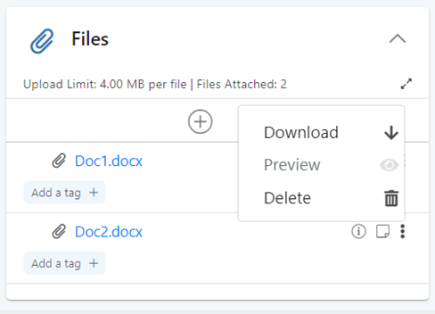
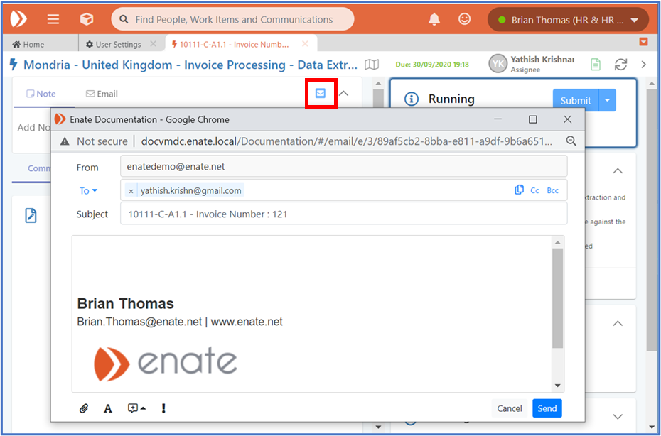
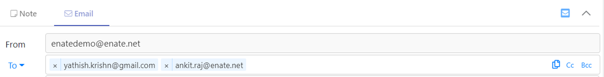
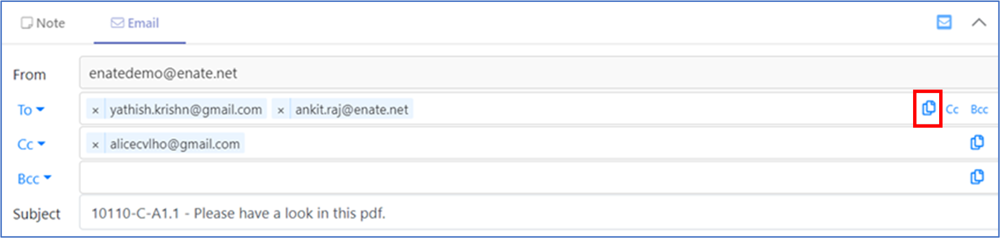
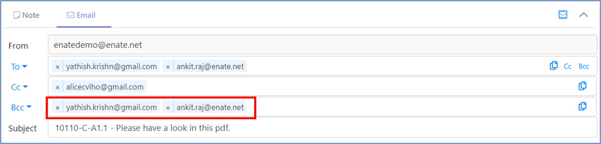
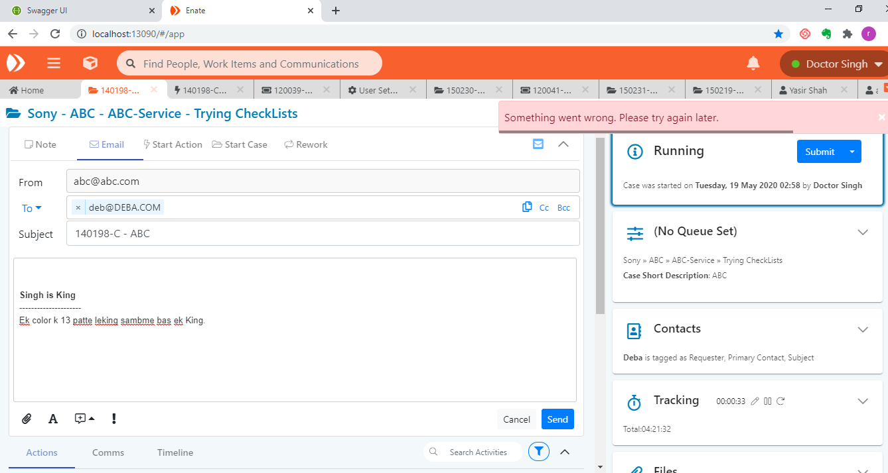
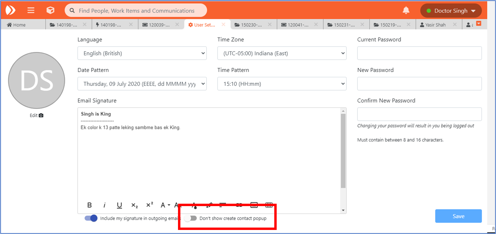
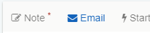

# 7.4 Composing Emails

If not replying / forwarding an existing email, you can write a new one from the email tab in the Activities tab.


Note: You can write an email without needing to have the work item assigned to you.


## A. Email toolbar

Via the email toolbar you can:

* Easily copy email addresses between the To/Cc/Bcc addresses via the ‘copy’ icon displayed when clicking into the relevant address field
* Toggle the display of Cc and Bcc Addresses \(these will initial show by default if there are any on the email\)
* Attach files to the email
* Access Email body formatting toolbar
* Access Canned Texts for inserting into email body

Set the email as high importance.

## B. Canned Texts

Canned Texts are standard pre-configured texts which are created as part of system configuration.

When writing an email, you can insert a Canned Text by clicking on the Canned Texts icon at the bottom of a write an email screen. This will show you all canned texts available for the Service Line and you can use the free text search function to filter items by title.

You can also use the ‘recently used’ option by clicking on the dropdown list, allowing you to quickly access a more relevant canned text. You can also manually modify canned texts after they have been inserted into your email.


Note: Any files linked to the canned text section will also be attached at the same time.


**Show by Language**

You can also select a canned text in a different language by clicking on the language in the dropdown list.


Note: The system will show the canned text in your language by default.


## C. Attaching files to an email

Files can be attached to an email in various ways. You can attach from your local drives by clicking on the ‘From disk’ icon on the Attach File button dropdown. You can also attach files that are already attached to the Work Item by clicking on the File from the on the Attach File button dropdown.


Note:

* Files which have been attached since the last time the work item was saved will display in this dropdown.
* Files attached to existing emails within the work item will also be available for selection here.


Files which have been linked to a standard Canned Text will automatically attach to the email when the canned text is selected.

When emails are auto-generated and sent by the system, the email template used may be linked to one or more tags – the system will identify any files currently attached to the work item which have been tagged with this same value, and will auto-attach them to the email before sending. For more information, see section [_Auto-attachment of Files to inserted Email Content with matching Tags_](7.9-individual-side-panel-cards.md#auto-attachment-of-files-to-inserted-email-content-with-matching-tags).

### Preview Of Attachments

Documents within a Work Item can be previewed with a single click – this relates to any document files which can be seen in the **Comms**, [Timeline](7.5-composing-emails.md), and [Files Card](7.9-individual-side-panel-cards.md#e-files-card) sections. The document previews will open in a new tab.

* Attachments in the files card can be previewed by clicking on the ‘More Options’ icon and then selecting ‘Preview’.

* If the file is not previewable, a confirmation banner pops out for the to explain this, plus offering an option to download the file.

* The file types supported for preview are as follows: **txt**, **pdf**, **jpg**, **jpeg**, **jpe**, **jif**, **jfif**, **jfi**, **png**, **gif**, **web**, **tiff**, **tif**, **heif**,**heic**, **svg**, **svgz**.

### Drag and Drop of Attachments into Email Section

This functionality enables you to drag and drop attachments from their desktop into the **Email section**.

### Download multiple attachments

It is possible to download multiple attachments with a single click from mails in the comms and timeline section. Clicking on the ‘Download all’ icon will download all attachments present in that Comms / Timeline section item.

## D. Email Body Formatting Toolbar

Clicking on the Email Format icon will reveal a row of formatting options for the main boy of the email.

You can:

* Make the text Bold, Italic and Underlined
* Select the font family
* Select the font size
* Select the text colour
* Select the background colour
* Select text alignment options
* Add a numbered list
* Add a bullet list
* Insert a link
* Insert an image
* Insert a table


Note: Undo is supported when composing emails by using Ctrl-Z.


## E. Copy / Paste of Excel, Word and Web information.

You can copy/paste information into emails from external documents, e.g. Excel tables and Word document content, as well as HTML information from webpages.

## F. Responding to emails

You can reply / forward emails from the timeline by clicking on the links available. These buttons will be enabled when you mouse over the email card.

## G. Email Pop out

If you wish to dedicate more screen space to view emails, you can use the available pop out feature.

## H. Rules for To, From, Cc, Bcc Addresses

System behaviour for entering email addresses is as follows:

* When sending a new email, the system will default the To address to that of the Primary Contact in the contacts section. Cc Address will also default to email addresses entered in the Ccs section.
* If more than one possible From email address is configured, the system will populate the default one \(configured as default in Builder\), and will display a dropdown to allow the alternate ones to be selected.
* These standard rules for default and suggested addresses can be overridden for To, Cc and Bcc for Cases and Actions in Builder configuration. Addresses set as default will auto-populate \(more than one can be set in this way\). Override addresses not set as default will be available for quick selection by clicking the To / Cc/ Bcc button address:


Note: The From address always displays in the email composition section when you are writing an email. This ensures that the sender will always have a view of the email address being used as the from when sending out emails from a particular work item.


## I. Copy-paste of Email Addresses between To, Cc, Bcc.

When composing emails, you can easily copy email addresses between the To/Cc/Bcc addresses via the ‘copy’ icon displayed when clicking into the relevant address field.

## J. Disable Email button

The Email send button is disabled when an email is being sent or when an attachment is being added to the email so that the end user doesn’t click the button more than once by mistake.

## K. Handle email error response

When there is an error sending an email and the API returns an error response \(for improper data or timeout\), a message is displayed in the GUI for the end user.

## L. External Contacts creation prompt for new email addresses

When you send out an email which contains new email addresses \(i.e. not linked to existing contacts\), the system will display a popup to allow you allow user to create them as new contact records.

If there are any email addresses for which you do not wish to create a new record, simply hover over the row and click the delete icon. Additionally, there is a ‘Do not show this again’ checkbox which when clicked will ensure you are not presented with this popup for subsequent new email addresses \(this can be switched back on again in the user profile section along with the mail signature settings\).

## M. Closing an item with incomplete emails

If you have started to write an email but have not saved / sent it, the tab will display a ‘\*’ marker on the tab alerting you to this.

If you subsequently try to close the work item tab with this ‘in-progress’ items still unsaved, the system will alert you asking if you wish to proceed.

