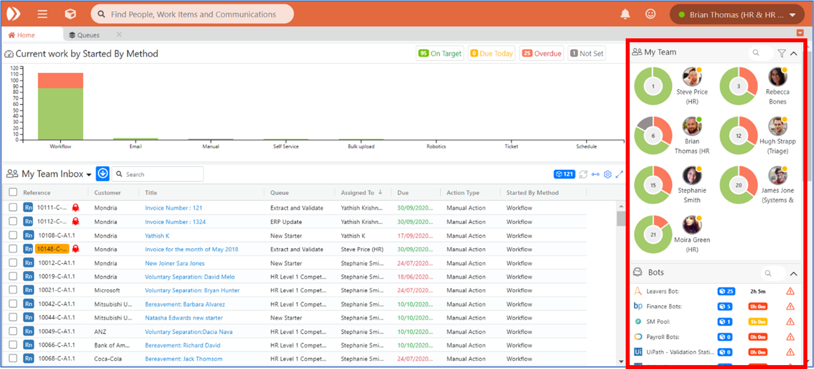
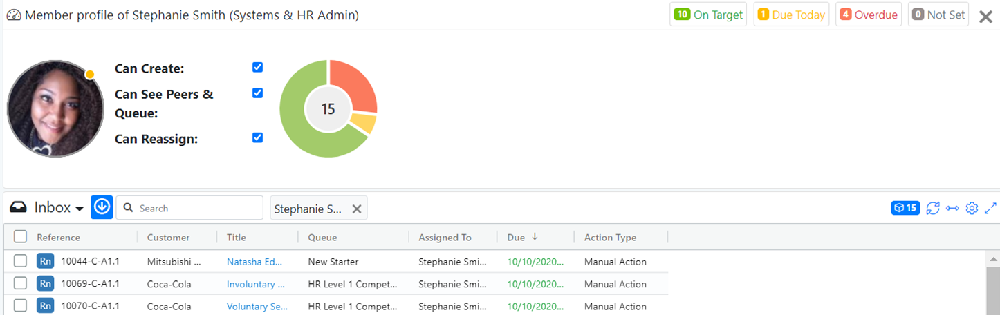
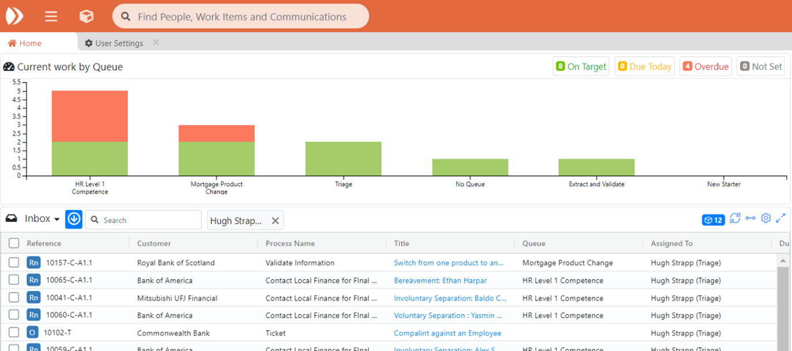

# 1.2 Team Bar

## A. Team Bar Overview



On the right hand side of the Home page is the Team Bar.

The Team Bar shows you:

**My Team** – The people in your Team and, for each of them:

* The amount of work they have outstanding \(number in centre of pie-chart\)
* The due status of that work \(i.e. Red/Amber/Green\)
* Their current availability status \(available or offline\)

**Bots** - Any Robots which are available to work on items you manage / work with, grouped by Robot farm :

* Each robot row displays a different robot farm, along with their Technology \(e.g. UiPath, Automation Anywhere, Blue Prism etc.\). The number of ‘bottable’ work items lined up for the robot farm will be displayed, as well as the estimated amount of work left available for the robot farm in minutes.
* If any of the Robots in the farm are offline or unresponsive, a warning icon will be displayed

**Unassigned Work**

* You can see the amount of work which is sitting unassigned in the Queues you manage at the foot of this section, grouped into each Queue. 
* Again, the RAG \(Red, Amber or Green\) status of that work can be seen. 
* If you have unassigned work which is overdue – i.e. any red items in this section, you should be looking to deal with that situation.

## B. My Team Display Options

You can sort your display of your team members by various criteria:

* Least / Most Work \(Total\)
* Least / Most Overdue \(Amber\)
* Least / Most Overdue \(Red\)
* Least / Most On Target \(Green\)

You can use this to help identify resources which are stretched and other team member who you may be able to share work out among to help balance workloads.

Free text search also allows for you to search for individual users from the list.

## C. Available / Offline Status for Team Members

This setting displays whether the person in question is currently online in the system.

### How does this work?

The system tracks your active Enate browser session, and so is able to check if they are still logged into Enate.


Note: if you do not log out properly, i.e. shut down the browser or machine directly without logging out of Enate, the system will display you as still online for the duration of the standard system timeout \(usually 30 minutes\).


An Important point is that this available / offline status is for informational purposes only – it is not taken into account as part of any allocation rules - i.e. the ‘Who does it go to?’ settings.

### Filter Team display by availability

The ‘My Team’ view section allows team leaders and members to filter the display of their team to show available / only offline / all users.

## D. Viewing an Individual User

Clicking on an individual user in the Team bar swaps out the bar chart main display to show the user profile AND filters down the grid results to show only work items currently assigned to that user.

In this view Team Leaders can view and modify the user’s ability to:

* Create work in business areas they have permissions on
* Reassign work they have permissions on
* See their ‘Peers and Queues’. This will allow your team members to see work which their peers are doing, and upcoming workload in their Queues
* The view can be closed to return to the standard bar chart view of all work items


Note: for Team Members, other team members’ profiles do not display, instead a bar chart of that other team member’s work shows.


## E. Viewing my Robots

Clicking on a Robot farm in the Bots section swaps out the bar chart main display to show that group of robots AND filters down the grid results to show ‘bottable’ work items.

On this view Team Leaders can:

* See the status of individual robots within the robot farm:
  * Idle \(available\)
  * Offline
  * Suspended – the bot’s average work is not within standard deviation, so it has been paused
  * Busy Integrated – the bot is busy working on a task that is has been assigned to
  * Busy Independent- the bot is busy working on a task that it has not been assigned to
* View the work currently being done by individual robots
* Filter down the view to an individual robot
* See how much work is remaining for the bots to do \(both in volume, e.g. 20 items, and in how many minutes worth of work is remaining, i.e. how long we think it will take to complete all of those 20 items\).
* The system can make an estimate of the amount of work left in minutes because we have an ‘estimated duration’ value configured in Builder for different Actions. The system simply totals the value of these for the Actions currently available for the robots to do.

The grid will show projected start and end times for each piece of work, colour-coding the projected end date to show it if will breach the due datetime – this helps the Team Leader determine if they need to add further human / robot resources in order to meet SLAs.

The view can be closed to return to the standard bar chart view of all work items.



## F. Team Bar for Team Members

If you are a Team Member, you won’t see the Bots section in your Team Bar, you will only see your My Team section and you Unassigned Work section.

